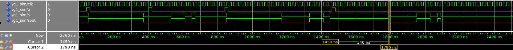
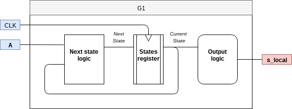

# Digital Systems 03/05/2015 - Report Lab 1

1. [Setting up the environment](##Setting up the environment)
    * [Configuring GITLAB](###Configuring GITLAB)
    * [Initialization of the simulation environment](###Initialization of the simulation environment)
2. [Simulating the G1 component](##Simulating the G1 component)
    * [Study case](###Study case)
    * [Compilation Errors Correction](###Compilation Errors Correction)
    * [The myLib library contents](###The myLib library contents)
    * [Simulation](###Simulation)
    * [Bug correction](###Bug correction)
    * [Delta cycles visualization](###Delta cycles visualization)
    * [A Drawing of the component](###A Drawing of the component)
3. [Bonus Questions](##Bonus Questions)
    * [Implementing a Synchronous Reset](###Implementing a Synchronous Reset)
    * [Changing the behavior of G1 component](###Changing the behavior of G1 component)
    

## Setting up the environment

### Configuring GITLAB

In order to be able to access the repository, which is on Eurecom Gitlab server, I need to perform some configuration.

Even if not strictly necessary, but for an easier use, I created a new public/private sra key pair on my machine. This will let me avoid to insert credential whenever I need to perform an operation with the remote directory (e.g. pull, push).
After this I modified the .git/config file in order to let git know about the keys location and update they keys section on my Gitlab profile.
Finally, the repository is cloned and then the personal branch is created.

### Initialization of the simulation environment

As I am using an Eurecom machine, in order not to fill up all the space available, I created a working directory in the /tmp subdirectory. Here I will send all the compilations results and other kinds of data.

```bash
$ tmp=/tmp/simili/20180305
$ mkdir -p $tmp
```

Then, to configure it as the work directory for Modelsim, I have run:

```bash
$ cd $tmp
$ vlib myLib
$ vmap work myLib
```


The vlib command generates a modelsim.ini which is the configuration file for Modelsim. 
Then it is updated with the vmap command setting the work directory to myLib (by default the work directory is called "work" and it is created where you launch the commands)


## Simulating the G1 component

### Study case

Copied from [README.md](README.md):

The following figure shows the external interface of a signal generator:


The behavior of `g1` is illustrated by the following waveforms:


Input `clk` is a clock. `g1` is synchronous on the rising edge of `clk`.  Input `a` is a command signal: when active on a rising edge of `clk` it starts a 5-phases macro-cycle:
* `s='1'` for 16 cycles of `clk`, then
* `s='0'` for 8 cycles of `clk`, then
* `s='1'` for 4 cycles of `clk`, then
* `s='0'` for 2 cycles of `clk`, then
* `s='1'` for 1 cycles of `clk`, then `s='0'` (unless `a='1'` and a new macro-cycle starts)

When a macro-cycle is running, the value of `a` is ignored. So, if we number the rising edges of `clk`, starting at 1 for the rising edge where `a` is active, a new macro-cycle cannot start before edge 32. If `a` is active at edge 32 a new macro-cycle starts immediately, without `s` going back to `'0'` between the two macro-cycles (`s` thus remains high for 17 cycles: one as the last phase of the first macro-cycle and 16 as the first phase of the second macro-cycle).

### Compilation Errors Correction

The compilation of g1.vhd, as provided, fails because of some errors. 

Here are the modifications made to correct these.


* Some errors were given from typos: the architecture name is arc and not acr and the same for the process name which is p and not q.
* Another was given because of a missing `end loop;` statement.
* The other errors were caused by the fact that we use Variables instead of Signals.
In this case we need to use signals instead of variables. The two in fact are pretty different:
Variables in fact can only be used inside a process and not outside (this is why we got the compilation error).
Then the two have different behaviours: Variables that are assigned, immediately take the value of the assignment. Signals depend on if it's combinational or sequential code to know when the signal takes the value of the assignment. 
In this case we need signals. So also the synthax have to change accordingly converting the variable assignemen (':=') into signal assignment ('<=')

In order to compile and simulate faster, I wrote a small script based on TCL language (which is supported by Modelsim).

```bash
# commands to be run from tmp directory

#set variables
set SRC_PATH "/homes/simili/dig_sys/ds-2018/20180305/vhdl/"
set TMP_PATH "/tmp/simili/20180305"

#Compile the files (in order!)
vcom $SRC_PATH\g1.vhd 
vcom $SRC_PATH\g1_sim.vhd

#set up simulation of g1_sim entity (this opens Modelsim)
vsim g1_sim 

# Add all ('*') the waveforms of the signal  
add wave *

# Finally run the simulation (till the end, when no more operations can be executed)
run -all
```

### The myLib library contents

As stated before, the myLib folder as the role of a "Design Library". Here we can find all the compiled files.
It is also used by ModelSim to keep track about all design units and their state in your design.
Exploring the directory where myLib is, we can see some interisting files such as:

* **modelsim.ini** : configuration file for Modelsim
* **transcript** : a transcript of commands run in Modelsim
* **vsim.wlf** : file containing the waveform results of last simulation in terms of a dataset.


### Simulation

Here is the waveform from the simulation.


It is possible to see that the behaviour is not correct. In fact there should be 3 macrocycles instead of 2. The one missing is on the last activation of the `a` which is instead lost. Here the correct behaviour would be to start immediately the next macrocycle without lowing the output signal to 0.
This problem is due to the fact that the component does not check `a` exits the loop just after the rising edge of the 32nd clock cycle. This leads to not checking the `a` on the right clock cycle and missing it.


### Bug correction

As stated before, the bug can be corrected simply checking the `a` signal immediately after exiting. (Not waiting for a rising edge again).

Here is the waveform that shows the correct behaviour wile the corrected code is available here [vhld/g1.vhd](vhld/g1.vhd).




### Delta cycles visualization

It is possible, thanks to the delta visualization modes, to see the simulation cycles. Here is a snapshot of them on the first edge of the output signal.


Even if it may seem that these events are happening one after the other, in reality they are not. This the way that Modelsim has to simulate the concurrency of the signal. Theoretically it is like they are happening at the same time.
However, a sequence of cause-effect events can be reconstructed from this waveform:
1. The clock signal in the testbench is raised high @50ns
2. The g1 process (`p`) is then waken up and raises the `s_local` signal.
3. as `s_out` is wired to `s_local` a modification of the ladder provokes a change of the former in the next simulation cycle.

### A Drawing of the component

The g1 waveform generator can be easily represented with a Finite State Machine logic. In fact if we think about the macro cycle as an alternation of different states. 
Here is the representation of the component as a Finite State Machine.




However, as the waveform alternate high and low period with a duration that scales by two every time, the design could be simplified (and maybe optimized) using a Counter (5 bits). In fact, each bit frequency scales by two going from the LSB to the MSB. The `a` could become the Enable signal of the counter. Then, some more logic would be necessary to reach the desired result.

Example for 3 bits.

3rd (MSB) (T=8) | 2nd (T=4) | 1st (LSB) (T=2) 
--- | --- | --- 
0 | 0 | 0 
0 | 0 | 1 
0 | 1 | 0
0 | 1 | 1
1 | 0 | 0
1 | 0 | 1
1 | 1 | 0
1 | 1 | 1


## Bonus Questions

### Implementing a Synchronous Reset

The easiest way to implement a synchronous reset without modifying the code too much, is simply using the "exit" statement. In fact, this behaves like a "break" in a loop. 
Clearly we must be careful when introducing this kind of statements in vhdl because they could not be synthesizable. However, searching in the web it seems to be so (with certain conditions). 
Of course, as there are two nested loops, we need two "exit" statements to emulate the reset.
Finally, we also need to change the entity adding a new input bit for the reset. The final code is available here [vhld/g1_reset.vhd](vhld/g1_reset.vhd)

The testbench also has to be modified. In fact we need to adapt it to the new component and also introduce the stimulus for the reset signal. Here is the code for the testbench [vhld/g1_sim_reset.vhd](vhld/g1_sim_reset.vhd)

The behaviour of the synchronous reset can be appreciated here below:


### Changing the behavior of G1 component

Here, we need to change the behaviour of the wave generator such that `a` is not ignored during the macrocycle, but it causes a restart of the macrocycle.

Again, the easiest way to do so is with the "exit" statement which would reset the outer loop.

The testbench in this case does not have to be modified with respect to the original case. 

The code is available here [vhld/g1_abort.vhd](vhld/g1_abort.vhd), while down below are the waveforms. 


