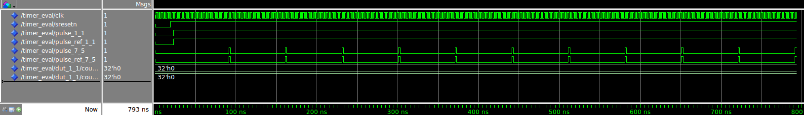
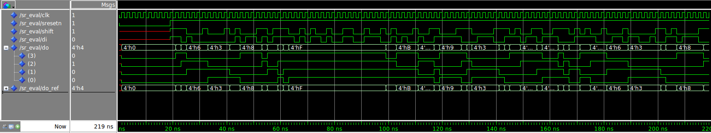
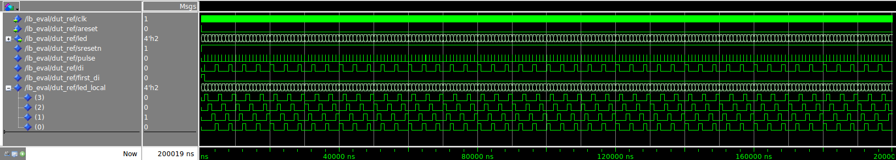

# Digital Systems 26/05/2017 - Report Lab 4

1. [Challenges](## Challenges)
    * [Shift Register](### Shift Register)
    * [Timer](###Timer)
    * [LED Blinking](### LED Blinking)
2. [Implementation of the LED Blinking on the board](## Implementation of the LED Blinking on the board)
    * [Synthesis script completion](### Syntehsis script completion)
    * [Utilization report](### Utilization report)
    * [The top\_wrapper\_timing\_summary\_routed](### The top\_wrapper\_timing\_summary\_routed)
    * [Testing on board](### Testing on board)

## Challenges

### Shift Register

In this challenge, it was required to implement a shift register.
This could be done in two ways:
- Using `loops` over the register. Doing so each bit is assigned to the next one and the shift is reached.
- Using slices and concatenation. This way with just one move, we can assign the whole register for the next clock cycle.

In this case, the second solution have been implemented. It is also the most convenient one as it avoids to deal with complicated `loops` (in cases more less trivial than this).

The simulation results are provided down below. The [vhdl/sr_eval.vhd](vhdl/sr_eval.vhd) has been used as a testbench environment.

 

### Timer

The timer has been implemented in a behavioural way. Instead of implementing a counter that counts directly on the clock cycle, 2 counters were used:

- First one counting at each clock cycle and raises `tick` signal every time it counts `frequency` clock cycles
- Another counting evat every `tick` signal from previous counter. This then raises up the output signal every `timeout` counts.

As the counter is implemented backwards, in order to know when the counter reaches the maximum number of counts, we need to check when counter value *wraps*, i.e. when the counter reaches value `0`, then it starts again from the maximum value.
If the starting value is a power of two, we could use the std_logic_integer vector for emulating such a situation. then in order to increment and decrement we could use some conversion operation to ease the process.
Otherwise, an easier way to do it is to simply check when the value reach the zero. Than the next value of the counter is the starting value (`frequency` or `timeout`).

Using such a metodology, we have the possibility to tweak the resolution of the timer and the frequency using two parameters (`frequency` and `timeout`). We will see how to use this two parameters during the implementation.

Here are the result of the validation of the component.

 

### LED blinking

Now, the objective is to use the previous developed components for the implementation of a more "advanced" one.\
The *LED blinking* has light one LED at a time and every certain amount of time, shift the LED (switching off and lighting the next one).
 53 |   LUT as Shift Register                   |    0 |     0 |           |       |

The shift register could be used for this purpose. In this case two have been implemented:

- One for the synchronizing the reset. We can connect the `asynch_res` to the `di` port and considering as the reset the last bit of the output.
- The other for implmenting the led shifting 

The code is available here [vhdl/lb.vhd] and results of the simulation are shown below:

 

## Implementation of the LED Blinking on the board

Once all the components have been validated, the synthesis on the board can be done easily.
To accomplish so, a script provided is used. However, it is necessary to map the pins. Reading the manual and the schematics of the Zybo board, it is possible to get the Pin names and the respective working voltages.

This table can resume the mapping.

| PORT | PIN | VOLTAGE |
| -- |:---:| --:|
| clk         | L16 | LVCMOS33 |
| areset      | R18 | LVCMOS33 |
| led[0]      | M14 | LVCMOS33 |
| led[1]      | M15 | LVCMOS33 |
| led[2]      | G14 | LVCMOS33 |
| led[3]      | D18 | LVCMOS33 |

The modified code is available here [scripts/lb-syn.tcl](scripts/lb-syn.tcl).

Another factor that has to be regulated, is the frequency and timeout value. Taking into account that the clock frequency is at 125 MHz, we need to rescale this frequency, otherwise it is impossible to enjoy the behaviour of the component.

In this case I assigned 500 to `frequency` and 100000 to `timeout`. We expect the frequency to be scaled of 500*100000= 50 millions times. Resulting in a frequency of 2.5 Hz. So the leds should switch every 0.4 seconds.

### Utilization report

The Utilization report is a report that provides us information about how the synthesis has been performed on the fpga. 
As the name says, it deals with the utilization of FPGA cells. An FPGA is a component which synthesize logic function through the use of Look Up Tables (LUT). These are cells which implements a small memory (usally 16 bits) that can implement any boolean logic (with 4 bits inputs in the case of 16 bits memory). If we can program a memory, then the addresses can be seen as all the possible configurations of the inputs, and the memory value as outputs. As all the possible configurations are not used in general and as the the memory size would increase exponentially with the number of input ports, instead of implementing the circuit with a unique memory, it is preferable to have many memories to reach the objective. Moreover, in order to replicate a sequential behaviour, the luts cells come together with some flip flops. The programming of an FPGA will need to write on the memory elements (LUTs or multiplexers for driving connections (to flip flops for example).
The combination of LUTs and other elements is a slice. Generally you have for each slice: 

  - 4 LUTs

  - 8 FFs

  - 2 F7MUX

  - 1 F8MUX

The report is divided in several section. I will comment the most important (the whole report is available at [synthesis_results](synthesis_results))

- Slice Logic

As said before, slices are the smallest units of the FPGA. We see that among the slices luts, 52 (0.30 %) have been employed for implementing logic functions (none of them has been used for implementing memory, this is necessary when you need more memory)
Instead 37 Slices Registers (0.11 %)  have been used for implementing the sequential behaviour.

Then we know that the registers have been implemented with synchronous set and reset.

From these utilization percentages we can understand that our circuit is very small compared to the maximu capacity of the FPGA board.

- Slice Logic Distribution

Here, the reports gives statistic on how the LUTs have been used, considering for example the output used, or whether it has been used to implement RAM memory.

- Memory

 
It gives statistics on the memory implemented (what type of memory or how many blocks). In this case we have no memory. So it is all 0.

- IO and GT Specific

It returns information about how the padsIO of the FPGA have been used.

### The top\_wrapper\_timing\_summary\_routed report

This file contains information about the timing of the synthesis. 
Firstly, it resumes the constraints requested during the synthesis. 
Then it checks if the designs contains *latch loops* or *combinational loops*. 
Then there can be the possibility to implement more than one clock (even not coming from a clock source)

Finally, it checks the arrival time of the clock at different endpoints. In FPGA we could encounter problems of clock routing that generates some skew.

### Testing on board

Here is a gif that shows the behaviour of the "LED blinker".

 

### DHT11 Sensor Driving

For the implementation of this component, we will need to do some careful consideraton.

First we will need to provide `power supply` to the device. This can be done using one of the pin present in the board. We need to choose it carefully with respect to the specification in the datasheet. Also a `ground` must be provided by the board.

As the Data transmission is composed by 40 bits, we will need at least one `register` of this size to store it. It can be convenient to have a `shift register` as the data are provided in a serialized way. It could be convenient to have a `memory` if we think to perform some averaging of the values (at multiple of 2 to avoid complex divisions).

The `timer` is needed in order to regulate the transmission. In this case I would suggest to have a dynamic `timeout`, i.e. being able to decide till what number to count. So we can use the same timer in different situations.
A `counter` can also be needed to know whether you have a zero or a one. And so a `comparator` can make this decision.
As the protocol uses checksum, and `adder` should be used (so we need to report the failure to the controller)
Some `logic` for implementing the protocol is also needed.
`Flip flops` can be used for synchronizing the signal. 
The `clock` must be fast enough not to miss any value. However a proper rescaling with a timer can be needed.

