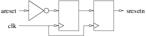
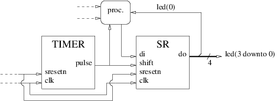

<!-- MASTER-ONLY: DO NOT MODIFY THIS FILE-->
# LED blinking (45 minutes)

In this challenge we will assemble our shift register and our timer to create a LED blinking design.

## Interface

Edit the file named `lb.vhd` (for Led Blinking) in the `20180326` directory. An entity named `lb` is arlready coded with the following generic parameters:

| Name       | Type                            | Description                                                         |
| :----      | :----                           | :----                                                               |
| `freq`     | `positive range 1 to 1000`      | Master clock frequency in MHz (also clock periods per micro-second) |
| `timeout`  | `positive range 1 to 1000000`   | Number of micro-seconds between two output pulses                   |

... and the following input-output ports:

| Name       | Type                            | Direction | Description                                                              |
| :----      | :----                           | :----     | :----                                                                    |
| `clk`      | `std_ulogic`                    | in        | Master clock. The design is synchronized on the rising edge of `clk`     |
| `areset`   | `std_ulogic`                    | in        | **Asynchronous**, active **high** reset                                  |
| `led`      | `std_ulogic_vector(3 downto 0)` | out       | Will be wired to the 4 user LEDs                                         |

## Architecture

In the same VHDL source file add an architecture named `arc` that:

* Instanciates one [shift register](sr.md) and one [timer](timer.md).
* Uses `clk` as its master clock. The design is synchronized on the rising edge of `clk`.
* Inserts an inverter and a 2-stages shift register between the `areset` input and a `sresetn` internal signal to synchronize the asynchronous active high reset and deliver a synchronized active **low** reset:

    

* Uses `sresetn` as a **synchronous**, active **low** reset.
* Configures the timer for a `freq` clock frequency and a `timeout` timeout.
* Connects the timer `pulse` output to the `shift` input of the shift register.
* Contains the necessary process(es) to inject a single `'1'` in the shift register the first time it shifts, and then loop back the rightmost output bit to the input. This will turn it into a rotating 4-bits register with 3 of the stored bits unset and one set. Decide whether this(these) process(es) shall be synchronous or combinatorial.
* Sends the current value of the shift register to the `led` output.



## Validation

````bash
$ cd $tmp
$ vcom $vhdl/sr.vhd $vhdl/timer.vhd $vhdl/lb.vhd $vhdl/lb_sim.vhd
$ vsim lb_sim
```

## Peer review

After the end of the challenge, compare your solution with your neighbours'.

<!-- vim: set tabstop=4 softtabstop=4 shiftwidth=4 noexpandtab textwidth=0: -->
