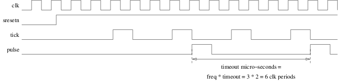

<!-- MASTER-ONLY: DO NOT MODIFY THIS FILE-->
# Timer (30 minutes)

Measuring time is sometimes useful. In this coding challenge we will design a two-stages synchronous counter. The first stage will run at full clock speed and produce a tick every micro-second. The second one will count at the tick rate and thus count micro-seconds.

## Interface

Edit the file named `timer.vhd` in the `20180326` directory. An entity named `timer` is arlready coded with the following generic parameters:

| Name       | Type                            | Description                                                         |
| :----      | :----                           | :----                                                               |
| `freq`     | `positive range 1 to 1000`      | Master clock frequency in MHz (also clock periods per micro-second) |
| `timeout`  | `positive range 1 to 1000000`   | Number of micro-seconds between two output pulses                   |

... and the following input-output ports:

| Name       | Type         | Direction | Description                                                              |
| :----      | :----        | :----     | :----                                                                    |
| `clk`      | `std_ulogic` | in        | Master clock. The design is synchronized on the rising edge of `clk`     |
| `sresetn`  | `std_ulogic` | in        | **Synchronous**, active **low** reset                                    |
| `pulse`    | `std_ulogic` | out       | Asserted high for one `clk` clock period every `timeout` micro-seconds   |

## Architecture

In the same VHDL source file add an architecture named `arc` that:

* Uses `clk` as its master clock. The design is synchronized on the rising edge of `clk`.
* Contains a first counter of type `natural range 0 to freq-1`:
    * which reset value is `freq-1`,
    * that decrements at `clk` clock frequency,
    * that wraps around `0` and restarts at value `freq-1`,
    * that asserts an internal `std_ulogic` signal named `tick`, during one `clk` clock period, every time it wraps, that is, when it transitions from `0` to `freq-1`,
* Contains a second counter of type `natural range 0 to timeout-1`:
    * which reset value is `timeout-1`,
    * that decrements on `clk` rising edges when `tick` is asserted,
    * that wraps around `0` and restarts at value `timeout-1`,
    * that asserts the `pulse` output, during one `clk` clock period, every time it wraps.
* Uses `sresetn` as its **synchronous**, active **low** reset to force the two counters to their reset values.

The `pulse` output shall thus be periodic and its period shall be `timeout` micro-seconds. The figure below represents the `clk`, `sresetn`, `tick` and `pulse` signals for `freq=3` and `timeout=2`.



## Validation

````bash
$ cd $tmp
$ vcom $vhdl/timer.vhd
$ vcom $vhdl/timer_sim.vhd
$ vsim timer_sim
```

## Peer review

After the end of the challenge, compare your solution with your neighbours'.

<!-- vim: set tabstop=4 softtabstop=4 shiftwidth=4 noexpandtab textwidth=0: -->
