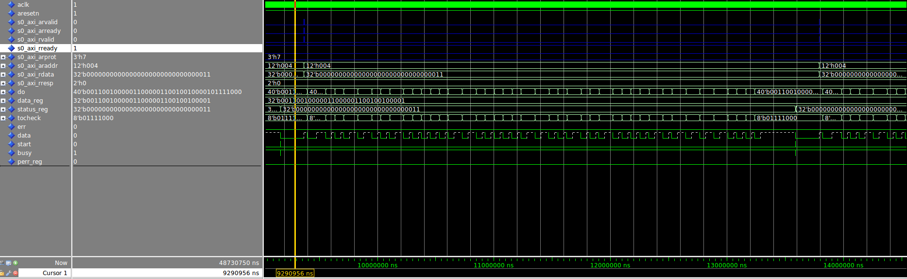

# Digital Systems 23/04/2018 - Report Lab 7

1. [AXI DHT11 controller](## AXIL4Register)
    * [Overview design](### Overview design)
    * [The data register](### The data register)
    * [The status register](### The status register)
    * [The axi protocol](### The axi protocol)
    * [Simulation results](### Simulation results)
2. [Testing from Linux Kernel](## Testing from Linux Kernel)

## AXI DHT11 controller

The objective of this lab is to design an entity for make the DHT11 constroller communicate with the Arm processor in the Zybo board using the AXI4 Lite protocol. 
This entity will provide two registers that can be accessed from the processor. A first register containing the measured data and a second containing a status register. Each of them is mapped at a particular location in memory, which are respectively 0 and 4. 

The sensor will be implemented so that it is always running measurements that are stored in an internal register. Then,the value can be transferred to the processor using the AXI4 Lite protocol. 

The source file is available at [vhdl/dht11_ctrl_axi.vhd](vhdl/dht11_ctrl_axi.vhd)

### Overview design

In order to reach the objective, we can reuse the `dht11 controller` previously designed. 

However, some considerations about the signals must be done:

- The 'error' output that memorizes the protocol errors for the dht11 controller will be kept in an internal 1 bit register (`perr_reg`)
- The 'starting' input will be high at every falling edge of the busy signal for taking measurement continueosly
- Internal register that store the status and the data have to be designed. These will be two `read only` registers that the protocol will access.

### The data register

The data register will contain only the 32 MSBs of the `do` output of the `dht11_ctrl`, i.e. the ones containing the temperature and the humidity measuraments.

No particular effort must be done for this register and it can be modeled with a simple synchronous process:

```
-- process for storing the output of the controller to the internal data register
    process (aclk)
    begin
        if rising_edge(aclk) then
            if aresetn = '0' then
                data_reg <= (others => '0');
            else
                if start = '1' then
                    data_reg <= do(39 downto 8); 
                end if;
            end if;
        end if;
    end process;
```

### The status register

Like we did for the data register, a simple synchronous process can be used for describing the status register updates even if in this case, depending on the bit, conditions must be satisfied:

```
-- process for driving the control status register 4 LSBs
    process (aclk)
    begin
        if rising_edge(aclk) then
            if aresetn = '0' then
                status_reg(3 downto 0) <= (others => '0');
            else
                status_reg(0) <= busy;
                if start = '1' then
                    status_reg(2) <= perr_reg;
                    if first_start = '0' then
                        status_reg(1) <= '0'; 
                    else
                        status_reg(1) <= '1';
                    end if;
                    if tocheck /= do(7 downto 0) then
                        status_reg(3) <= '1';
                    else
                        status_reg(3) <= '0';
                    end if;
                    
                end if;
            end if;
        end if;
    end process;
```

The `first start signal` is the output/state of a very trivial FSM which simply goes to state `first_start` whenever a start occurs after a reset. In this case the state is also the output of the machine (so only one process can be used).

```
-- process for checking the first start after the reset
process (aclk)
begin
    if rising_edge(aclk) then
        if aresetn = '0' then
           first_start <= '0' ;
        end if;
        if first_start = '0' then
             if start = '1'  then
                 first_start <= '1';
             end if;
        end if;
    end if;
end process;

```
### The axi protocol

With respect to previous implementation of the AXI register, no changes had to be done for what concerns the Finite State machines.
However, the read and write operation will behave slightly different as the registers involved have been changed. 

In particular the writing operation will not write any registers but simply has to take care of the error conditions. 

```
-- writing on the register
    process (aclk)
    begin
        if rising_edge(aclk) then
            if aresetn = '0' then
                s0_axi_bresp <= (others => '0');
            else
                if s0_axi_awvalid = '1' and s0_axi_wvalid = '1' and CurrStateW = IDLE then
                    if  addr_w_aligned = "0000000000" or addr_w_aligned = "0000000001"then                        
                        s0_axi_bresp <= axi_resp_slverr;
                        s0_axi_bresp <= axi_resp_slverr;
                    else
                        s0_axi_bresp <= axi_resp_decerr;
                    end if;
                end if;
            end if;
        end if;
    end process;
```
The read operation instead needs to be performed only on the status and the data register.

```
-- Process for driving the status and data signal to the output rdata    
    process (aclk)
    begin
        if rising_edge(aclk) then
            if aresetn = '0' then
                s0_axi_rdata <=  (others => '0');
                s0_axi_rresp <= (others => '0');
            else
                if s0_axi_arvalid = '1' and CurrStateR = IDLE then
                    if addr_r_aligned = "0000000000" then
                        s0_axi_rresp <= axi_resp_okay;
                        s0_axi_rdata <= data_reg;
                    elsif addr_r_aligned = "0000000001" then
                        s0_axi_rdata <= status_reg;
                        s0_axi_rresp <= axi_resp_okay;
                    else
                        s0_axi_rdata <= (others => '0');
                        s0_axi_rresp <= axi_resp_decerr;
                    end if;
                end if;
            end if;
        end if;
    end process;
```


### Simulation results

The validation of the circuit has been proven thanks to the automatic evaluation system present in `Gitlab`. However the waveforms can be apprecciated here:




## Testing from Linux Kernel

In order to check the correctness, we need to log into the OS installed in the arm processor. This can be done with the serial connection provided by the board using `piconet` from the host PC.

Once we connect, we can read the data accessing to the memory location where the registers have been mapped. This can be done with `devmem` command. Here are the result:

```bash
Sab4z> devmem 0x40000000
0x26001A00
```

We can see that the temperature is stored in the third byte (0x1A = 0d26) and not in the first as we may expect. However this is simply the consequence of the Little Endian notation used by ARM processor.

```bash
Sab4z> devmem 0x40000004
0x00000003
```

The status register always reads 3 (0b11). This means that the *data_reg* contains the read data and the *dht11_ctrl* is busy


