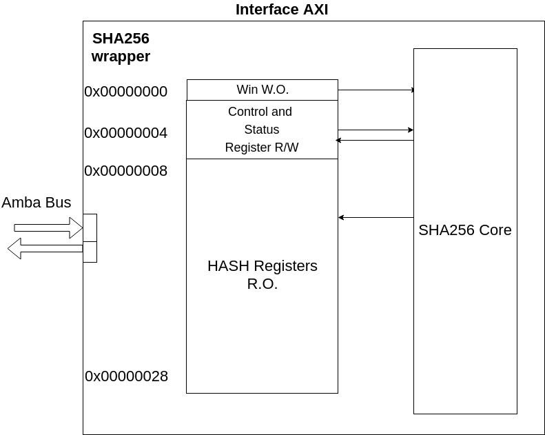
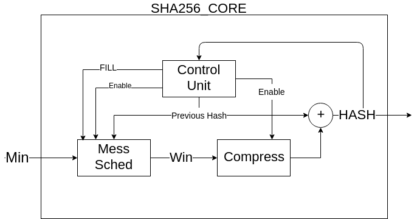
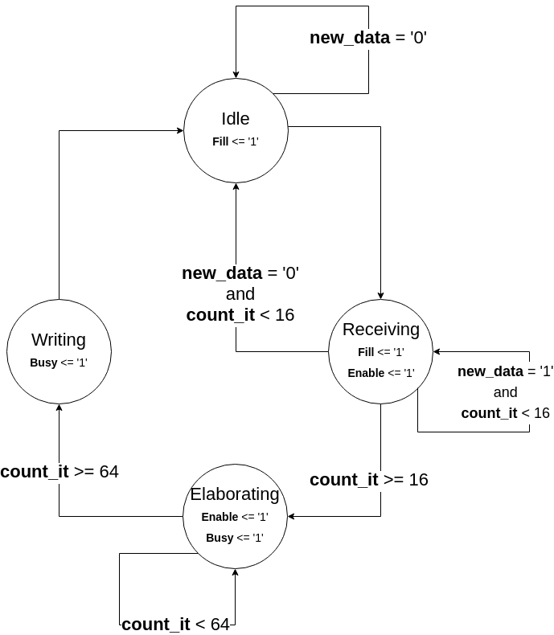
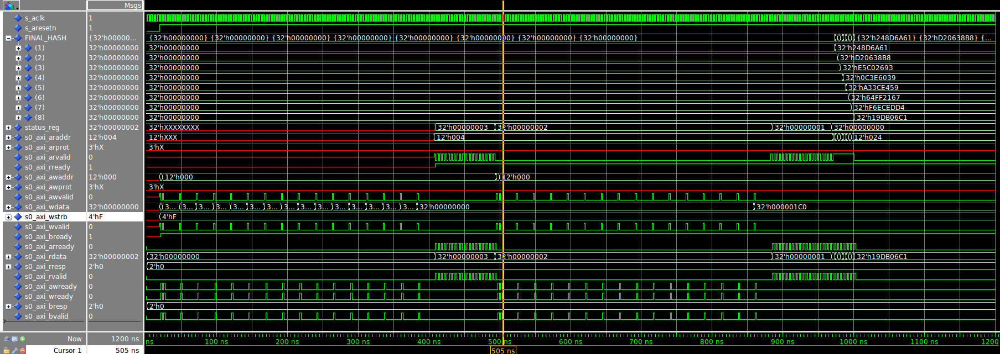

# REPORT SHA256 Hardware accelerator - Digital Systems

1. [Introduction](## Introduction)
2. [Hardware Sofware specifications](### Hardware Sofware specification)
    * [The registers](The registers)
3. [Hardware Design](### Hardware Design)
    * [sha256_core scheme](### sha256_core scheme)
    * [Message scheduler scheme](### Message scheduler scheme)
    * [Compression scheme](### Compression scheme)
    * [Control Unit diagram](### Control Unit diagram)
    * [Simulation results](### Simulation results)
    * [Synthesis results](### Synthesis Results)
4. [Software Design](## Software Design)
    * [Subdivision of the tasks] (### Subdivision of the tasks)
    * [Device Driver design](### Device Driver design)
    * [Application design](### Application design)
5. [Install and testing](## Install and testing)
6. [Some Improvement considerations](## Some Improvement considerations)

## Introduction
  The objective of this laboratory is to design an hardware accelerator that performs the SHA256 algorithm. The entity is stand alone and has to be synthesized on the FPGA provided by the Zybo Board. The device must be properly configured so that it can communicate through the AXI protocol with the Zynq core. Ultimately the device will be interfaced with the Linux Kernel running on the ARM core as a Linux device thanks to a driver that manages the communication between the Hardware piece and the software running on the top.
  To facilitate the utilization of such device, an application is designed which permits to HASH the content of a text file.


## Hardware-Software specifications
  The hardware accelerator for a specific application is used to unload the processor workload. This way, the processor, instead of executing the instructions needed to perform that application, will instead just limit to pass the data to be computed and read a result. In the mean time, if the design is made properly, the processor can use its resources and does not spend time in computation.
  This is good because CPU generally are more adapt for less regular computation (unlike the sha256 which is instead very regular).
  Keeping this in mind, it is important to divide the Hardware and the Software worlds, so that the Hardware accelerator is left only with the most regular operations (which highly benefit from the parallelism provided by an hardware design).
  Taking a look at the SHA256 algorithm, we first see that it is necessary to code the message properly.
  In fact as the algorithm works with 512 bits chunks, so the original message needs to be modified through a technique named Padding.
  This can be resumed with the following steps:

  - Append the bit '1' to the end of the message
  - Append *k* zero bits, where k is the smallest number of bits for which the sum of the length of the message, the number of zeros plus one modulus 512 is 448
  - Append 64 bits containing the length of the message


  As the padding algorithm seems to be very irregular (it does not benefit from a hardware implementation) and as the hardware design of this operation will probably be quite difficult, it has been decided to implement this operation at a software level. Moreover, as this operation is performed only once (last bits of the message), the overhead introduced on the processor will be very minimal.

  Then, blocks of 512 bits are analyzed one after the other following the pseudo code here provided:

  ```C
  Initialize registers a; b; c; d; e; f; g; h

  for(i = 0; i<64; i++){
    compute next Word (Win)
      Compute next a,b,c,d,e,f,g,h
  }
HASH = H_partial + H_prev
```

The hardware core limits to compute this operations at a block level.

However, as the algorithm works with words of 32 bits every clock cycles and as the processor will communicate with 32 bits data ports, the SHA256 entity core will have an interface with 32 bits as input and 256 bits as output (the HASH) plus clock, reset and signals that notify about the internal state.




### The registers

  Clearly the processor will not access directly the core, but will instead communicate with another entity that introduces some abstraction (a wrapper).

  So, from the processor point of view, the peripheral is seen as some registers that can read or write. These registers are:


##### The status and control register

  This register contains information about the status of the component. In particular, the LSB is used to notify whether the component is busy (meaning that it will ignore any that sent) because it is finishing the computation of the previous block. This is useful for two main reasons:

* Notifying that the hash of a block is finished (and so the hash, if after the last stage, is ready)

  * Avoid the processor to send more data as it will ignore them.

  This register is also used to set some control signal on the peripheral. In particular it is used to pass when the processor is sending the first block. In this case, the component needs to use some default data and not the hash from previous blocks.
  However, it is right to say that this two register should have been kept separated and mapped in two memory regions, as one read only (STATUS REGISTER) and on write only (CONTROL REGISTER) instead of having only one both readable and writable register only on certain bits. However for the sake of simplicity, and as we need only two bits, they have been kept like that.

##### The data_in register

  Used to receive the words of the blocks to be hashed

##### The data_out registers
  Used to store the output of the HASH. It is up to the processor to decide, checking the busy bit and knowing when the last block is sent, whether or not these registers have valid data. It is convenient to map multiple registers at more different memory locations so that the HASH can be read simply reading at incremental addresses.


## Hardware Design

  The design of the Hardware requires to design the following entities and so writing the following VHDL files:

- [sha256_pack.vhd](vhdl/sha256_pack.vhd) : this file contains the many functions that implement most of the operation needed for either the message scheduler or the compression phase. It also contains many declaration of types that are recurrently used during the design (such as the type *word* which is a *std_ulogic_vector* of 32 bits). This file also contains a function which is implemented through variables and using VHDL as a programming language (and not as a description language) which computes the HASH in one step. This function has been used just to check the provide a reference value to check during the testbench and so will NOT be synthesized.
- [sha256_msched.vhd](vhdl/sha256_msched.vhd) : This module implements the algorithm that computes the signal Win which is needed in the compression stage.
- [sha256_compr.vhd](vhdl/sha256_compr.vhd) : This module works with local signals (the letters a,b,c,d,e,f,g,h) making some operations. After 64 cycles, their values are summed up with the previous HASH and return a new HASH.
- [sha256_core.vhd](vhdl/sha256_core.vhd) : This module simply combine the pieces and computes the HASH from the output of the compression stage and the previous HASH.
                                                                                                                                                                                        - [sha256_wrap.vhd](vhdl/sha256_wrap.vhd) : This module worries mainly in interfacing the sha256_core with the AXI protocol. It implements the FSMs which regulate the AXI Lite transactions and implements the register that will be accessed by the outside world.

### sha256_core scheme



  From the picture above it is possible to see the interaction of the 3 main sub modules (CU, Message scheduler and Compression).
  The operation of sum that generates the final HASH is left to the hosting entity. Moreover, the final output is updated only when the entity receives an enable signal from the CPU that indicate the end of the algorithm.


### Message scheduler scheme

  The diagram below, taken from the documents provided, describes the



  Considering each rectangular as a registers which shift, it is easily possible to implement the wanted algorithm.
  In the first 16 cycles, the registers are loaded (starting from the first and then propagating) with new value in the first register and propagating.
  After, the output of the shift registers becomes the wanted value.

### Compression scheme
  The compression scheme is very similar to the one used in the Message scheduler and also the implementation is almost identical.
  For sake of completeness, here is the scheme:


### Control Unit diagram

  The control Unit implements the Finite state Machine that is described in this simple state diagram:


  As the master is in charge to notify the component about new messages and will only send data when it is allowed to, the number of states is reduced considerably. Some other states that manage errors could have been implemented but it is not necessary in this case because the driver will be designed properly without presenting any error conditions. However, it is always good practice to manage some error conditions since the early stages of the design.

  The control unit is also in charge to implement the counter of the iterations in a behavioural way. Another option could have been to design a counter as a in another entity and drive it using some control signal. However,
  it has been found more convenient to implement it in this manner.


### Simulation results

  The validation of the design has been performed in two steps:
  - On the sha256_core
  - On the sha256_wrap

  So two different testbenches have been created that send data and simulate the external world signals. Moreover, as the simulations validation on the waveform could take some time, some printing operations to files have been written. This way, it is also possible to debug variables which do no appear in waveforms. As said earlier, a reference function has been implemented to check the correctness of the result. In order to verify intermediate result, a small {python script}(scripts/verify.py) has been written.

  Here are the waveforms from the [simulation](vhdl/sha256_wrap_sim.vhd) of the AXI wrapper:





### Synthesis results
  First it is necessary to write a synthesis [tcl](scripts/sha256_ctrl_axi.syn.tcl) script to facilitate the synthesis process.
  Starting from the one used in previous laboratories, we indicate that we do not need any additional I/O port as we will only communicate through the Amba bus signals.

  The synthesis is launched with the command:

  ```bash
  vivado -mode batch -source $ds2018/sha256/scripts/sha256_ctrl_axi.syn.tcl -notrace -tclargs $ds2018
  ```

#### Log file
  The execution fortunately did not return errors. However, it is possible to check the warnings in the log file.

  ```
  WARNING: [Synth 8-3331] design sha256_wrap has unconnected port s0_axi_awprot[2]
  WARNING: [Synth 8-3331] design sha256_wrap has unconnected port s0_axi_awprot[1]
  WARNING: [Synth 8-3331] design sha256_wrap has unconnected port s0_axi_awprot[0]
  WARNING: [Synth 8-3331] design sha256_wrap has unconnected port s0_axi_wstrb[3]
  WARNING: [Synth 8-3331] design sha256_wrap has unconnected port s0_axi_wstrb[2]
  WARNING: [Synth 8-3331] design sha256_wrap has unconnected port s0_axi_wstrb[1]
  …
  WARNING: [Synth 8-327] inferring latch for variable 'K_s_reg' [/tmp/simili/sha256/vv/top.srcs/sources
  _1/bd/top/ipshared/b1af/sha256_wrap.srcs/sources_1/imports/vhdl/compression.vhd:72]
  WARNING: [Synth 8-327] inferring latch for variable 'H_start_reg[1]' [/tmp/simili/sha256/vv/top.srcs/
  sources_1/bd/top/ipshared/b1af/sha256_wrap.srcs/sources_1/imports/vhdl/cu.vhd:110]
  WARNING: [Synth 8-327] inferring latch for variable 'H_start_reg[2]' [/tmp/simili/sha256/vv/top.srcs/
  sources_1/bd/top/ipshared/b1af/sha256_wrap.srcs/sources_1/imports/vhdl/cu.vhd:110]
  WARNING: [Synth 8-327] inferring latch for variable 'H_start_reg[3]' [/tmp/simili/sha256/vv/top.srcs/
  sources_1/bd/top/ipshared/b1af/sha256_wrap.srcs/sources_1/imports/vhdl/cu.vhd:110]
  …
  ```

  Here we can read that:
  - Many warnings came from *not connected pins*, but this was expected as we are not using all the pins present in the AXI Lite protocol.
  - Many others inform that the design used some latches. This situation should generally be avoided as it could present problems with reading and writing procedure. Moreover, as they are memory elements, the introduction of latches could bring to a much larger design (and probably slower). As many times, there are many false latches given missing *others* or *else* condition, the latches can be eliminated easily and so it has been done.
#### Timing results
  For the synthesis initially it has been considered a clock of 10 ns. Unfortunately, the [timing analysis](Reports/top_wrapper_timing_summary_routed.rpt) reported slack violation on the most critical Path. Surprisingly (but not too much), the design has been synthesized and made working even in this condition (curious to see how it could affect the working).

  Afterwards, as the slack was violated of about 3 ns, I increased the clock period of 5 ns and the slack became not negative anymore.
  Here is the most critical path time analysis:


  ```
  Max Delay Paths
  --------------------------------------------------------------------------------------
Slack (MET) :             1.699ns  (required time - arrival time)
  Source:                 top_i/sha256_wrap/U0/sha256_block_0/cu_0/count_it_reg[29]/C
                          (rising edge-triggered cell FDRE clocked by clk_fpga_0  {rise@0.000ns fall@7.000ns period=14.000ns})
  Destination:            top_i/sha256_wrap/U0/sha256_block_0/compression_0/a_reg[30]/D
(rising edge-triggered cell FDRE clocked by clk_fpga_0  {rise@0.000ns fall@7.000ns period=14.000ns})
  Path Group:             clk_fpga_0
  Path Type:              Setup (Max at Slow Process Corner)
  Requirement:            14.000ns  (clk_fpga_0 rise@14.000ns - clk_fpga_0 rise@0.000ns)
  Data Path Delay:        11.941ns  (logic 4.976ns (41.670%)  route 6.965ns (58.330%))
  Logic Levels:           18  (CARRY4=9 LUT4=3 LUT5=3 LUT6=3)
  Clock Path Skew:        -0.178ns (DCD - SCD + CPR)
Destination Clock Delay (DCD):    2.679ns = ( 16.679 - 14.000 )
                                  Source Clock Delay      (SCD):    2.987ns
                                    Clock Pessimism Removal (CPR):    0.130ns
                                  Clock Uncertainty:      0.213ns  ((TSJ^2 + TIJ^2)^1/2 + DJ) / 2 + PE
                                  Total System Jitter     (TSJ):    0.071ns
                                    Total Input Jitter      (TIJ):    0.420ns
                                  Discrete Jitter          (DJ):    0.000ns
                                    Phase Error              (PE):    0.000ns
                                  Location             Delay type                Incr(ns)  Path(ns)    Netlist Resource(s)
  -------------------------------------------------------------------    -------------------
(clock clk_fpga_0 rise edge)
  0.000     0.000 r
  PS7_X0Y0             PS7                          0.000     0.000 r  top_i/ps7/inst/PS7_i/FCLKCLK[0]
  net (fo=1, routed)           1.207     1.207    top_i/ps7/inst/FCLK_CLK_unbuffered[0]
  BUFGCTRL_X0Y15       BUFG (Prop_bufg_I_O)         0.101     1.308 r  top_i/ps7/inst/buffer_fclk_clk_0.FCLK_CLK_0_BUFG/O
  net (fo=1438, routed)        1.679     2.987    top_i/sha256_wrap/U0/sha256_block_0/cu_0/aclk
  SLICE_X11Y39         FDRE                                         r  top_i/sha256_wrap/U0/sha256_block_0/cu_0/count_it_reg[29]/C
  -------------------------------------------------------------------    -------------------
  SLICE_X11Y39         FDRE (Prop_fdre_C_Q)         0.456     3.443 r  top_i/sha256_wrap/U0/sha256_block_0/cu_0/count_it_reg[29]/Q
  net (fo=4, routed)           1.111     4.554    top_i/sha256_wrap/U0/sha256_block_0/cu_0/count[29]
  SLICE_X10Y36         LUT5 (Prop_lut5_I3_O)        0.124     4.678 f  top_i/sha256_wrap/U0/sha256_block_0/cu_0/b[31]_i_6/O
  net (fo=4, routed)           0.836     5.514    top_i/sha256_wrap/U0/sha256_block_0/cu_0/b[31]_i_6_n_0
  SLICE_X10Y34         LUT6 (Prop_lut6_I5_O)        0.124     5.638 r  top_i/sha256_wrap/U0/sha256_block_0/cu_0/T1__0_carry_i_8/O
  net (fo=62, routed)          1.326     6.964    top_i/sha256_wrap/U0/sha256_block_0/cu_0/compression_0/K_s1__16
  SLICE_X7Y22          LUT4 (Prop_lut4_I0_O)        0.118     7.082 r  top_i/sha256_wrap/U0/sha256_block_0/cu_0/T1__0_carry_i_9/O
  net (fo=1, routed)           0.440     7.521    top_i/sha256_wrap/U0/sha256_block_0/cu_0/compression_0/K_s__63[1]
  SLICE_X6Y22          LUT4 (Prop_lut4_I2_O)        0.326     7.847 r  top_i/sha256_wrap/U0/sha256_block_0/cu_0/T1__0_carry_i_6/O
  net (fo=1, routed)           0.000     7.847    top_i/sha256_wrap/U0/sha256_block_0/compression_0/S[1]
SLICE_X6Y22          CARRY4 (Prop_carry4_S[1]_CO[3])
  0.533     8.380 r  top_i/sha256_wrap/U0/sha256_block_0/compression_0/T1__0_carry/CO[3]
  net (fo=1, routed)           0.000     8.380    top_i/sha256_wrap/U0/sha256_block_0/compression_0/T1__0_carry_n_0
SLICE_X6Y23          CARRY4 (Prop_carry4_CI_CO[3])
  0.117     8.497 r  top_i/sha256_wrap/U0/sha256_block_0/compression_0/T1__0_carry__0/CO[3]
  net (fo=1, routed)           0.000     8.497    top_i/sha256_wrap/U0/sha256_block_0/compression_0/T1__0_carry__0_n_0
SLICE_X6Y24          CARRY4 (Prop_carry4_CI_CO[3])
  0.117     8.614 r  top_i/sha256_wrap/U0/sha256_block_0/compression_0/T1__0_carry__1/CO[3]
  net (fo=1, routed)           0.009     8.623    top_i/sha256_wrap/U0/sha256_block_0/compression_0/T1__0_carry__1_n_0
SLICE_X6Y25          CARRY4 (Prop_carry4_CI_O[1])
  0.323     8.946 r  top_i/sha256_wrap/U0/sha256_block_0/compression_0/T1__0_carry__2/O[1]
  net (fo=2, routed)           0.670     9.616    top_i/sha256_wrap/U0/sha256_block_0/compression_0/T1__0_carry__2_n_6
  SLICE_X12Y25         LUT5 (Prop_lut5_I3_O)        0.306     9.922 r  top_i/sha256_wrap/U0/sha256_block_0/compression_0/T1__94_carry__2_i_2/O
  net (fo=2, routed)           0.585    10.507    top_i/sha256_wrap/U0/sha256_block_0/compression_0/T1__94_carry__2_i_2_n_0
  SLICE_X13Y25         LUT6 (Prop_lut6_I0_O)        0.124    10.631 r  top_i/sha256_wrap/U0/sha256_block_0/compression_0/T1__94_carry__2_i_6/O
  net (fo=1, routed)           0.000    10.631    top_i/sha256_wrap/U0/sha256_block_0/compression_0/T1__94_carry__2_i_6_n_0
SLICE_X13Y25         CARRY4 (Prop_carry4_S[2]_CO[3])
  0.398    11.029 r  top_i/sha256_wrap/U0/sha256_block_0/compression_0/T1__94_carry__2/CO[3]
  net (fo=1, routed)           0.000    11.029    top_i/sha256_wrap/U0/sha256_block_0/compression_0/T1__94_carry__2_n_0
SLICE_X13Y26         CARRY4 (Prop_carry4_CI_CO[3])
  0.114    11.143 r  top_i/sha256_wrap/U0/sha256_block_0/compression_0/T1__94_carry__3/CO[3]
  net (fo=1, routed)           0.000    11.143    top_i/sha256_wrap/U0/sha256_block_0/compression_0/T1__94_carry__3_n_0
SLICE_X13Y27         CARRY4 (Prop_carry4_CI_O[3])
  0.313    11.456 r  top_i/sha256_wrap/U0/sha256_block_0/compression_0/T1__94_carry__4/O[3]
  net (fo=3, routed)           0.932    12.387    top_i/sha256_wrap/U0/sha256_block_0/compression_0/p_1_in[23]
  SLICE_X25Y30         LUT5 (Prop_lut5_I0_O)        0.306    12.693 r  top_i/sha256_wrap/U0/sha256_block_0/compression_0/a_s__0_carry__5_i_4/O
  net (fo=2, routed)           0.615    13.309    top_i/sha256_wrap/U0/sha256_block_0/compression_0/a_s__0_carry__5_i_4_n_0
  SLICE_X24Y30         LUT6 (Prop_lut6_I0_O)        0.124    13.433 r  top_i/sha256_wrap/U0/sha256_block_0/compression_0/a_s__0_carry__5_i_8/O
  net (fo=1, routed)           0.000    13.433    top_i/sha256_wrap/U0/sha256_block_0/compression_0/a_s__0_carry__5_i_8_n_0
SLICE_X24Y30         CARRY4 (Prop_carry4_S[0]_CO[3])
  0.513    13.946 r  top_i/sha256_wrap/U0/sha256_block_0/compression_0/a_s__0_carry__5/CO[3]
  net (fo=1, routed)           0.000    13.946    top_i/sha256_wrap/U0/sha256_block_0/compression_0/a_s__0_carry__5_n_0
SLICE_X24Y31         CARRY4 (Prop_carry4_CI_O[2])
  0.239    14.185 r  top_i/sha256_wrap/U0/sha256_block_0/compression_0/a_s__0_carry__6/O[2]
  net (fo=1, routed)           0.443    14.627    top_i/sha256_wrap/U0/sha256_block_0/compression_0/a_s__0_carry__6_n_5
  SLICE_X23Y32         LUT4 (Prop_lut4_I0_O)        0.301    14.928 r  top_i/sha256_wrap/U0/sha256_block_0/compression_0/a[30]_i_1/O
  net (fo=1, routed)           0.000    14.928    top_i/sha256_wrap/U0/sha256_block_0/compression_0/a[30]
  SLICE_X23Y32         FDRE                                         r  top_i/sha256_wrap/U0/sha256_block_0/compression_0/a_reg[30]/D
  -------------------------------------------------------------------    -------------------

(clock clk_fpga_0 rise edge)
  14.000    14.000 r
  PS7_X0Y0             PS7                          0.000    14.000 r  top_i/ps7/inst/PS7_i/FCLKCLK[0]
  net (fo=1, routed)           1.101    15.101    top_i/ps7/inst/FCLK_CLK_unbuffered[0]
  BUFGCTRL_X0Y15       BUFG (Prop_bufg_I_O)         0.091    15.192 r  top_i/ps7/inst/buffer_fclk_clk_0.FCLK_CLK_0_BUFG/O
  net (fo=1438, routed)        1.487    16.679    top_i/sha256_wrap/U0/sha256_block_0/compression_0/aclk
  SLICE_X23Y32         FDRE                                         r  top_i/sha256_wrap/U0/sha256_block_0/compression_0/a_reg[30]/C
  clock pessimism              0.130    16.809
  clock uncertainty           -0.213    16.596
  SLICE_X23Y32         FDRE (Setup_fdre_C_D)        0.031    16.627    top_i/sha256_wrap/U0/sha256_block_0/compression_0/a_reg[30]
  -------------------------------------------------------------------
  required time                         16.627
  arrival time                         -14.928
  -------------------------------------------------------------------
  slack                                  1.699
  ```


  As expected, the most critical path is in the compression stage. In particular, it passes through the additions performed to compute the new value of the *a* register.


#### Area results

  The [area](Reports/top_sha256_wrap_0_utilization_synth.rpt) report shows result about area occupation.


  ```
  1. Slice Logic
  --------------

  +----------------------------+------+-------+-----------+-------+
  |          Site Type         | Used | Fixed | Available | Util% |
  +----------------------------+------+-------+-----------+-------+
  | Slice LUTs*                | 1226 |     0 |     17600 |  6.97 |
  |   LUT as Logic             | 1162 |     0 |     17600 |  6.60 |
  |   LUT as Memory            |   64 |     0 |      6000 |  1.07 |
  |     LUT as Distributed RAM |    0 |     0 |           |       |
  |     LUT as Shift Register  |   64 |     0 |           |       |
  | Slice Registers            |  852 |     0 |     35200 |  2.42 |
  |   Register as Flip Flop    |  852 |     0 |     35200 |  2.42 |
  |   Register as Latch        |    0 |     0 |     35200 |  0.00 |
  | F7 Muxes                   |    0 |     0 |      8800 |  0.00 |
  | F8 Muxes                   |    0 |     0 |      4400 |  0.00 |
  +----------------------------+------+-------+-----------+-------+
  ```

  The design is surely bigger than the ones previously implemented but still it does not exploit the fully potential of the FPGA (less than 10 percent of utilization).
  Many LUT have been used for memory. This is probably due to the fact of having many constants that had to be stored inside the FPGA.

  The primitives section also tells what design, if any, have been implemented during the synthesis. For example, as many addition are performed, many adders have been synthesized. This is good news, because this way the FPGA will use its personal optimized modules.

  ```bash
  7. Primitives
  -------------

  +----------+------+---------------------+
  | Ref Name | Used | Functional Category |
  +----------+------+---------------------+
  | FDRE     |  852 |        Flop & Latch |
  | LUT3     |  358 |                 LUT |
  | LUT4     |  310 |                 LUT |
  | LUT6     |  266 |                 LUT |
  | LUT5     |  208 |                 LUT |
  | CARRY4   |  112 |          CarryLogic |
  | LUT2     |  104 |                 LUT |
  | SRL16E   |   64 |  Distributed Memory |
  | LUT1     |   32 |                 LUT |
  +----------+------+---------------------+
  ```


## Software Design
  The Software part consists of two programs:
  - Device driver
  - User level application

### Subdivision of the tasks
  The Linux driver needs to implement some I/O operations such as Read and Write in that access memory addresses. This operation is reserved so it is implemented inside the Linux kernel.
  The padding will be implemented at the user level space. This is convenient because it is a computational operation that should be avoided inside a Linux kernel, leaving it only the management of the memory accesses.

### Device Driver design

  In the [driver](C/sha256_driver.c) we need to indicate how many words it needs to read or write and at what address.
  As the read is performed at incremental address it will increment every time a read is performed.
  The Write will write in the same address at delayed times.

  Apart from writing these operations, no particular modification had to be done as the remaining modules used for designing a Linux Driver are pretty much the sames used in past lab.
  Only exception is the "compatible string", which had to be modified in order to conform with the one in the device tree description.


### Application design
  The application reads from a file the characters that need to be hashed. Every time it counts 512 bits or the file ends it writes the data into the device file descriptor.
  Then it waits until it is not busy, then it either write next blocks or it return the HASH. If the counter does not reach 512 bits, then the block is first padded properly and then sent as a block.

#### Padding
  For the last remaining bits, in order to perform padding the program either
  - Fill the block with '0's and write the number of bits sent in the last 64 bits,
  - Fill the block with '0's and then create a last one with '0's and the number of bits in the last 64 bits.

  This is performed code:

  ```C
  if (charin <  BLOCK_SIZE - PADD_SIZE) {
    block_buffer[charin] = (uint8_t) 0x80;
    for (i = charin+1; i < BLOCK_SIZE - 8 ; ++i) {
      block_buffer[i] = (uint8_t) 0x00;
    }
    do {
      check_busy(status);
      printf("STATUS is %02x%02x%02x%02x \n", status[0], status[1], status[2], status[3]);
    }while(status[0] & 0x02 == 0x02);
  }
else {
  //first complete the block with zeros and then write another block until Padd_size
  block_buffer[charin] = 0x80;
  for (i = charin+1; i < BLOCK_SIZE ; ++i) {
    block_buffer[i] = 0x00;
  }

  do {
    check_busy(status);
    printf("STATUS is %02x%02x%02x%02x \n", status[0], status[1], status[2], status[3]);
  }while(status[0] & 0x02 == 0x02);

  if (first == 1) {
    write_first(1);
  }
  write_block(block_buffer);
  if (first == 1) {
    write_first(0);
    first = 0;
  }
  for (i = 0; i < BLOCK_SIZE - PADD_SIZE ; ++i) {
    block_buffer[i] = 0x00;
  }
}

// bitnumber is chars*8
bitcount = count_chars << 3;

//Write the length of the message one byte at a time
block_buffer[BLOCK_SIZE - PADD_SIZE + 0] = (bitcount >> 56) & 0xFF;
block_buffer[BLOCK_SIZE - PADD_SIZE + 1] = (bitcount >> 48) & 0xFF;
block_buffer[BLOCK_SIZE - PADD_SIZE + 2] = (bitcount >> 40) & 0xFF;
block_buffer[BLOCK_SIZE - PADD_SIZE + 3] = (bitcount >> 32) & 0xFF;
block_buffer[BLOCK_SIZE - PADD_SIZE + 4] = (bitcount >> 24) & 0xFF;
block_buffer[BLOCK_SIZE - PADD_SIZE + 5] = (bitcount >> 16) & 0xFF;
block_buffer[BLOCK_SIZE - PADD_SIZE + 6] = (bitcount >> 8) & 0xFF;
block_buffer[BLOCK_SIZE - PADD_SIZE + 7] = bitcount & 0xFF;

```


#### Auxiliary function
In synthesis, the application limits to perform the following operations:

- Write a block
- Read the Hash
- Check if device is busy

For this purpose, the following auxiliary functions have been implemented:

```C
//Check if the device is busy for waiting before writing new block or to read the hash
void check_busy(unsigned char *buff)
{
  /*char buff[4];*/
  pread(f_sha, &buff[0], 4, STATUS_ADDR);
}

//write a block of 512 bits
int write_block(unsigned char * block_buffer)
{
  for (j = 0; j < 16; j++) {
    if (pwrite(f_sha,  &block_buffer[j*4], WORD_SIZE, DATA_W_ADDR) < 0) {
      printf("Error while writing a block\n");
    }
    else{
      /*printf("Will write this word 0x%02x%02x%02x%02x\n", block_buffer[j*4], block_buffer[j*4+1], block_buffer[j*4+2], block_buffer[j*4+3]);*/
      /*sleep(1);*/
    }
  }
  printf("Written block_buffer\n");
  return 1;
}

//read the hash
int read_hash(unsigned char hash_buffer[HASH_SIZE])
{
  for (j = 0; j < 8; j++) {
    pread(f_sha, &hash_buffer[j*4], WORD_SIZE, DATA_R_ADDR + j*4);
    /*printf("READ this word of the hash %02x%02x%02x%02x\n", hash_buffer[j*4+3],hash_buffer[j*4+2],hash_buffer[j*4+1],hash_buffer[j*4]);*/
    printf("Read a HASH word\n");
  }
}

// write in the status register the first_mess signal to notify it is the first block
int write_first(unsigned char first_m){
  printf("Setting the register for the start signal\n");
  unsigned char load[4];
  load[3] = first_m << 1;
  load[2] = 0;
  load[1] = 0;
  load[0] = 0;

  if (pwrite(f_sha, &load, 4, STATUS_ADDR) < 0) {
    printf("Error while writing a block\n");
  }
  else{
    printf("Written status register block\n");
    return 1;
  }
}

```

For the sake of simplicity, the busy signal is checked using polling technique (with busy waiting). In an optimal implementation, an interrupt signal would be used instead.


## Install and Testing

The implementation required to run all the operations performed in previous lab session. In particular, for this case we needed to:
- Generate the device tree binary with the new synthesized component.
- Produce the First boot loader
- Compile and install the correct driver and application for reading.

This time the Driver compiled is the one written for the purpose:


The application is cross compiled and then inserted in the fakeroot file system in the "/root" directory together with some test files.

Accessing using picocom utility it is possible to run the tests.

```bash
picocom -b115200 /dev/ttyUSB1
```

Then the module is loaded with the command:

```bash
insmod /lib/modules/4.6.0-xilinx-dirty/extra/sha256_driver.ko
```

Here we can appreciate the (successful) result from hashing a file that contains the message "Digital System is awesome! (once you are done)"

```bash
sha256> echo -n "abc" > test.txt
sha256> ./app_sha256 test.txt
Setting the register for the start signal
Written status register block
Written block_buffer
Setting the register for the start signal
Written status register block
Read a HASH word

ba7816bf8f01cfea414140de5dae2223b00361a396177a9cb410ff61f20015ad

sha256> echo -n "Digital Systems is awesome (once you are done)" > test.txt
sha256> ./app_sha256 test.txt
STATUS is 00000000
Setting the register for the start signal
Written status register block
Written block_buffer
Setting the register for the start signal
Written status register block
STATUS is 00000000
Read a HASH word

afff4ef15cebc3595279b7808c26d1617caf00f16319241ecbd7a22f6564baac

```

## Some improvement Considerations

During this work, many choices have been taken for the sake of simplicity. In fact, no particular care has been taken for performances.
However it is possible to do some considerations about some improvements that could be made:

- *The Datapath* : During the design of the Datapath, many operations have been implemented in a behavioural and straightforward way without taking much care about critical paths (which will determine the max working frequency). However as shown in an article, performances can be enhanced by noticing that it is possible to pre compute some partial results exploiting the shifting logic. This way the critical path is split in more stages, with a considerable increment of the maximum clock frequency.
- *The AXI protocol implementation* : in this design, the axi protocol is managed at the hardware level only by using a slave entity. However it is possible to design even a Master entity that can manage the communication and operations with the component. This way the CPU would be unloaded of the Input/Output operations.
- *Communication technique* : in order to check if the Hash was ready or simply to check if the peripheral is busy, a Polling technique has been implemented. Doing so, we waste many precious resources because of the busy waiting that occurs while checking for a certain condition. Instead an interrupt policy could be adopted, notifying the CPU only when needed.
- Other possible improvements could be done at the software level, in terms of *efficiency* and also making also some considerations for *maintenance* and expansions purposes.
