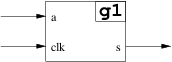
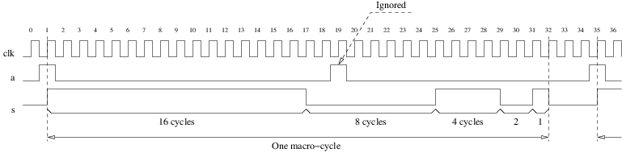

<!-- MASTER-ONLY: DO NOT MODIFY THIS FILE-->
# Modelsim tutorial (VHDL simulation)

* [Introduction](#introduction)
* [Environment set-up](#environment-set-up)
* [The G1 signal generator](#the-g1-signal-generator)
* [Compiling](#compiling)
* [Simulating](#simulating)
* [Bonus](#bonus)

### Introduction

With the following instructions you should be able to perform your first VHDL simulation with _Modelsim_ in less than 15 minutes.

Credits: this lab is made possible thanks to [Mentor Graphics] and its [Higher Education Program]. The HEP provides colleges and universities with leading edge design tools for classroom instruction and academic research at a very low price.

**Important note**: in the following the command lines that you're asked to type in begin with a `$`. This character represents the shell prompt and is not a part of the command.

### Environment set-up

* Open a terminal and add `/packages/LabSoC/Mentor/Modelsim/bin` to your `PATH` environment variable:

    ```bash
    $ export PATH=$PATH:/packages/LabSoC/Mentor/Modelsim/bin
    ```
  Or, if you want to use a specific VERSION:

    ```bash
    $ export PATH=$PATH:/packages/LabSoC/Mentor/Modelsim/VERSION/bin
    ```
  Note that you will have to type this command again every time you will want to use the tools from a new shell. In order to automatically perform this initialization at login, such that it is inherited by every new shell, add this command in your `~/.profile` initialization script:

    ```bash
    $ echo 'export PATH=$PATH:/packages/LabSoC/Mentor/Modelsim/bin' >> ~/.profile
    ```
* Assign the path to the directory of the VHDL source files to a bash variable:

    ```bash
    $ vhdl=/homes/mary/ds-2018/20180305/vhdl
    ```
* Create a temporary directory (out of your account) where all the files automatically generated by the tools will go:

    ```bash
    $ tmp=/tmp/mary/20180305
    $ mkdir -p $tmp
    ```
* Create a new VHDL library in the temporary directory:

    ```bash
    $ cd $tmp
    $ vlib myLib
    $ vmap work myLib
    ```
  This creates a directory named `myLib`, populates it with some files, creates a configuration file named `modelsim.ini` and customizes it such that the VHDL library named `work` is mapped to the `myLib` directory. As `work` is the default VHDL library, everything we compile will go there, unless we specify another target library. **Warning:** you should not change anything in the `myLib` directory! It is managed by the tools and if you interfer, things will probably go wrong...

`Modelsim` is now ready to compile. It knows and manages a working library (`work`). It knows this library is mapped to the `myLib` subdirectory. And because the name of this library is `work` it knows that, by default, every compilation will use it. So compiling with the command:

```bash
$ vcom -work work $vhdl/foo.vhd
```

or:

```bash
$ vcom $vhdl/foo.vhd
```

will make no difference.

### The G1 signal generator

The following figure shows the external interface of a signal generator:



The behavior of `g1` is illustrated by the following waveforms:



Input `clk` is a clock. `g1` is synchronous on the rising edge of `clk`.  Input `a` is a command signal: when active on a rising edge of `clk` it starts a 5-phases macro-cycle:
* `s='1'` for 16 cycles of `clk`, then
* `s='0'` for 8 cycles of `clk`, then
* `s='1'` for 4 cycles of `clk`, then
* `s='0'` for 2 cycles of `clk`, then
* `s='1'` for 1 cycles of `clk`, then `s='0'` (unless `a='1'` and a new macro-cycle starts)

When a macro-cycle is running, the value of `a` is ignored. So, if we number the rising edges of `clk`, starting at 1 for the rising edge where `a` is active, a new macro-cycle cannot start before edge 32. If `a` is active at edge 32 a new macro-cycle starts immediately, without `s` going back to `'0'` between the two macro-cycles (`s` thus remains high for 17 cycles: one as the last phase of the first macro-cycle and 16 as the first phase of the second macro-cycle).

### Compiling

* Compile `g1.vhd` with the `vcom` command. Note: the command `vcom` has a very useful `-help` option.
* Fix the syntax errors and recompile until there are no errors.
* Try to understand the warnings if any. Fix what needs to be fixed and recompile until you have a very good reason for ignoring all the remaining warnings.
* Have a look at the content of the directory `myLib` (but do not modify anything in there!)
* Compile `g1_sim.vhd`, a simulation environment for `g1`.

### Simulating

* Launch the simulator with the `vsim` command (guess what parameter is needed).
* In the `Objects` subwindow select the signals you are interested in, right-click and, in the popup menu, select `Add Wave`. This will add the signals to the waveform viewer (and automatically launch the waveform viewer). Add `clk`, `a` and `s` to the waveform viewer.
* In the `sim` subwindow select the `i_g1` label. The `Objects` subwindow should show you the internal signals of `g1`. If you fixed the syntax errors by transforming `s_local` into a signal, add `s_local` to the waveform viewer. Else, if you kept it as a variable, it has been optimized away and you cannot add it but this is not a problem.
* In the `Transcript` window type the command `run -all` and analyse the results in the waveform window.
* How many times is `a` active on a rising edge of `clk`? How many times shall it be ignored because a macro-cycle is already running? How many macro-cycles do you see and how many _should_ you see? If the results are not what you expected, fix the source code of `g1` and/or `g1_sim`, recompile and simulate again.
* Zoom on the beginning of the first macro-cycle and look at the rising edge of `clk` for which `a` is asserted. `clk`, `s_local` and `s` apparently change simultaneously. In the `Wave` menu select `Expanded Time`, then `Deltas Mode` and `Expand All`. The waveform viewer should now show you the delta-cycles (but remember that this representation is misleading: they have no physical duration). Try to understand the sequence of events. Is it what you would have imagined?

# Bonus

* Double-click on the `i_g1` label in the `sim` subwindow to open the `g1.vhd` source file. Put breakpoints, restart the simulation (`Simulate -> Restart...`), simulate step-by-step, examine the value of the signals and of the loop indices...
* Add a synchronous, active high, reset signal. Modify the simulation environment to drive it. Recompile and simulate.
* Modify the model so that the value of `a` is not ignored any more when a macro-cycle is running. Instead, on any rising edge of `clk` where it is asserted, it forces to abort the current macro-cycle and start a new one from the beginning.
* Play with the simulator, modify the source files to change the behaviour, compile and simulate again.

[Mentor Graphics]: https://www.mentor.com/
[Higher Education Program]: https://www.mentor.com/company/higher_ed/

<!-- vim: set tabstop=4 softtabstop=4 shiftwidth=4 noexpandtab textwidth=0: -->
