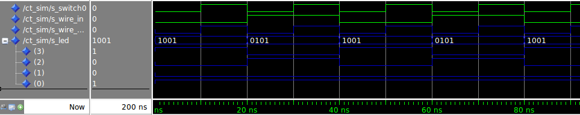
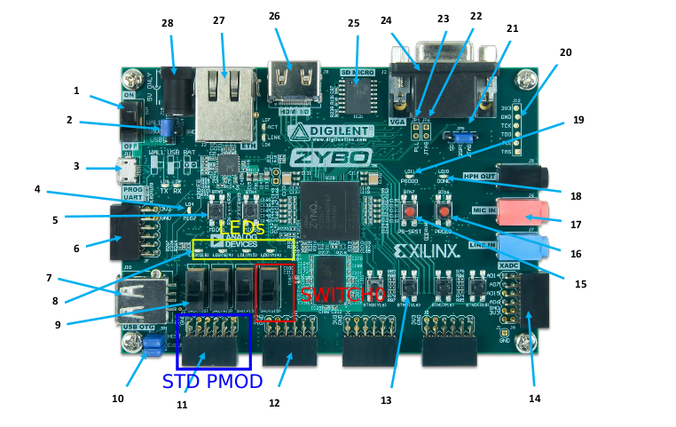
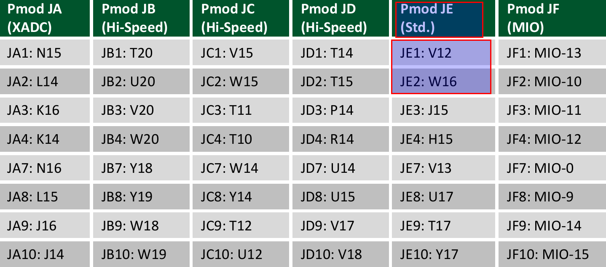
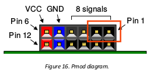
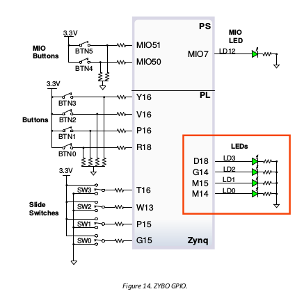
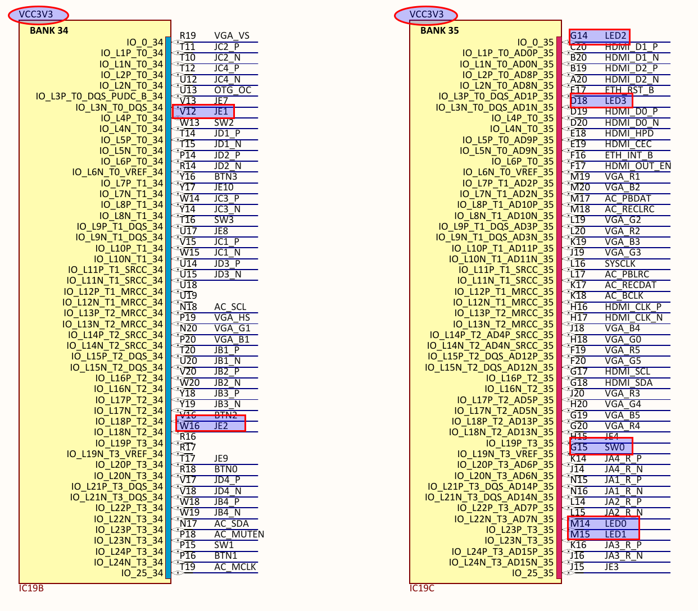

# Digital Systems 12/03/2015 - Report Lab 2

1. [Architecture](##Architecture)
2. [Compilaton](##Compilation)
3. [Simulation](##Simulation)
4. [Synthesis](##Synthesis)
    * [wire_in and wire_out](###wire_in and wire_out)
    * [leds](###leds)
    * [Voltage levels](###Voltage levels)
5. [Testing](##Testing)

## Architecture
The architecture for our component is very simple and can be easily represented in vhdl.
The entity will have:
- Two input bits (`switch0` and `wire_in`);
- 4 output bits ( for the `led` bit vector);
- 1 output bit (for the wire_out);
The architecture has been implemented as a simple process with the input inside the sensitivity list.
However, we can notice that it is not necessary to have a process for this kind of process as a simple wiring could be enough.

The complete code is available here: [vhdl/ct.vhd](vhdl/ct.vhd)


To produce a testbench entity, we just instantiate a void entity and call the component to be tested (in this case `ct`).
In order to test the component, I implemented the stimulus as an alternation of the signals such that to obtain every single configuration of input signals.
Note that here, as the interactions between input and output are very simple there would be no reason to put such an effort, but it still remains a good practice.
The testbench code can be found here: [vhld/ct_sim.vhd](vhld/ct_sim.vhd)


## Compilation
For the compilation (and then simulation), I wrote the following very simple script in tcl synthax: [scripts/compile.do](scripts/compile.do)

This can be run either from Modelsim (using `do` command) or directly from shell with the command:

```bash
vsim -do $script/compile.do
```

## Simulation
The simulation launched produces the following waveform (green for the inputs and blue for the outputs):




## Logic synthesis

For the logic synthesis into the board, the [scripts/ct-syn.tcl](scripts/ct-syn.tcl) is used. However the Pin configuration had to be set.
To accomplish that, we need to look for the ports on the ZYBO manual and see what is the connected pin.

A picture of the board is provided here:





### wire_in and wire_out

As specified in the interface, these two signal should be connected respectively to the firstand second pin of the JE pmod port.

To see which `pmod` port we have to choose, we can look at this table:



So the `pmod` needed is the so called `std pmod`. (The leftmost in the board)
From this, we also know the pins which are respectively `V12` and `W16`.

Another picture can help to know the physical locations of the pins:



### leds

The leds can be found in the GPIO section. Here is an extract from the manual:



So the pins needed will be `M14`, `M15`, `G14`, `D18`


### Voltage levels

In order to know what Voltage level we need to set, we have to look at the ZYBO elctrical schematics.
In particular, if we look at the following snip:





We can see that all the pins need a 3.3V power supply (like for the SW_0).

The complete tcl script is available at [scripts/ct-syn.tcl](scripts/ct-syn.tcl).

## Testing

In order to test the continuity, we can simply connect the `wire_out` to the `wire_in`. This way, as the `wire_out` is driven by the switch, we can assign value this way and see the effectiveness with the leds. So a positive result would validate the continuity of the cable.

Here is a GIF that shows the test:


