# Digital Systems 19/05/2015 - Report Lab 1

1. [Simulation and preparation of G1](##Simulation and preparation of G1)
2. [Synthesis of G1](##Synthesis of G1)
3. [Refinement of the model](###Refinement of the model)
    * [Block Diagram Drawing](###Block Diagram Drawing)
    * [Modification of the VHDL w.r.t. the diagram](###Modification of the VHDL w.r.t. the diagram)
    * [Files from Synthesis](###Files from Synthesis)
    * [Silicon Area of the circuit](###Silicon Area of the circuit)
    * [Critical Path and timing](###Critical Path and timing)
    * [Verilog Model netlist](###Verilog Model netlist)
    * [Number of flip flops](###Number of flip flops)
    * [Cells library datasheet](###Cells library datasheet)
4. [Schematics of synthesys result](##Schematics of synthesys result)
    * [Exploring the schematic](###Exploring the schematic)
    * [Locate endpoints of critical Path](###Locate endpoints of critical Path)
5. [Adding a reset to G1 and ](##Schematics of Synthesis)
    * [Synchronous reset](###Synchronous reset)
    * [Asynchronous reset](###Asynchronous reset)
    * [Synthesis for max clock frequency and minimum area](###Synthesis for max clock frequency and minimum area)
    * [Improve maximum clock frequency with shift register](###Improve maximum clock frequency with shift register)
    * [Improve minimum area](###Improve minimum area)
6. [Implementing G1 in Zybo board](##Implementing G1 in Zybo board)


## Simulation and preparation of G1

### Waveform analysis

The code provided did not require any modification for the simulation. In fact, the waveform shows the correct behaviour:

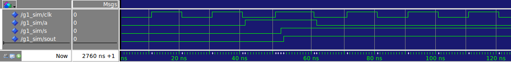

We can notice that the initial value of the output signal is '0'. However, this value was not assigned explicitly in our VHDL code. 
This is due to the fact that types are assigned a default initial value by the simulator and for the BIT this value is '0'.

## Synthesis of G1

### Analysis of the synthesis script

The synthesis script provided ([scripts/syn.tcl](scripts/syn.tcl)) is written in TCL and it is used by `Synopsys DC` for setting parameters and commands for the synthesis. 

From this script, it is possible to see 

* The *target clock frequency* :


    ```
    
        # Target clock period (ns)
        set CP 2.0
        
    ```
    
That is *2 ns*

* The *input and output delays* :

    ```
        # External delay on non-clock input signals (ns)
        set IDEL 0.5

        # External delay on output signals (ns)
        set ODEL 0.5
        
    ```
    *0.5 ns* for both input and output

* Some *synthesis parameters* :
    ```
        # Cell driving all inputs but clock
        set DRV DFFX2_RVT
    
        # External load on outputs (fF)
        set LOAD 2
    
        # Automatic selection of the wire load model (boolean)
        set AWLS true
    
        # Generate HTML log file (boolean)
        set HLE true
    
        # Name of HTML log file, e.g. dc_log.html
        set HLFN dc_log.html
    
        # Maximum number of cores to use (1 to 16)
        set MCORES 4
    
        # Name of target standard cells library
        set LIB saed32rvt_tt0p85v25c.db
        
    ```
### Launching the synthesis

As the `VHDL` code is not synthesizable, the synthesis will fail.
The error message the following:

``` bash
    Error:  /homes/simili/dig_sys/ds-2018/20180319/vhdl/g1.vhd:33: WAIT statement inside FOR loop is not supported. (ELAB-996)
    Error:  /homes/simili/dig_sys/ds-2018/20180319/vhdl/g1.vhd:33: WAIT statement inside FOR loop is not supported. (ELAB-996)
    ** Presto compilation terminated with 2 errors. **
    Error: Current design is not defined. (UID-4)
    ** ERROR: Could not elaborate g1 top-level entity **
```

In fact, the description of our circuit is too high level. In particular the use of the wait statements is not supported by the synthesis tool.

## Refinement of the model

### Block Diagram Drawing

Before proceding with writing the VHDL code, it is better to draw a schematics of the circuit. This way the VHDL code will be more straightforward.
For this, two almost equivalent schematics are presented:

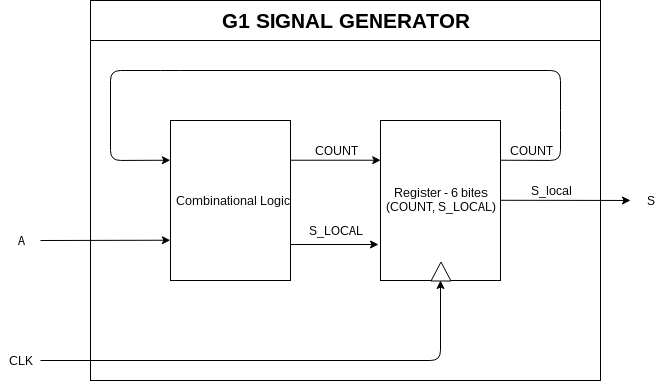
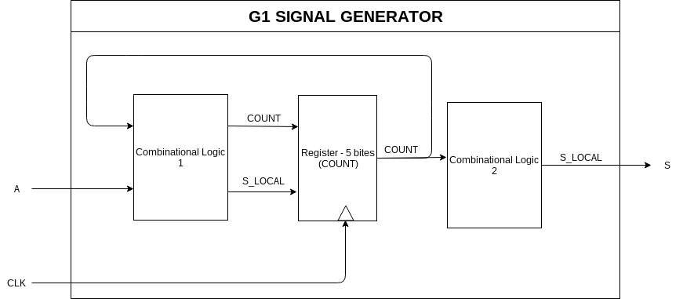

Even if the two models present the same behaviour, they present some big differences:

- In the first case, the output comes directly from the register. This means that it will contain the status bits (the counter value) and an additional bit for the output resulting in a bigger area since flip flops are relatively large cells with respect to combinational cells.

- In the second case, only the counter bits are kept in the register. However the output needs to pass through a combinational circuit first. This comports a bigger delay from the register and could bring problems if it is connected to other circuits.

In conclusion, as no specification beside the behaviour was specified, it is not possible to tell which option is better.


### Modification of the VHDL w.r.t. the diagram

For the synthesis the code is modified dramatically (The code is available here : [vhdl/g1_orig.vhd](vhdl/g1_orig.vhd)). The scheme implemented is the second (output directly from the register).
In particular, some major modifications consist of:
* The wait statements have been replaced with a sensitivity list.
* A variable is introduced keep the count of clock cycles
* The combinational circuit is expressed at a behavioral level through the use of `if...then...else` statements.
* The output coming from a register is guaranteed by having `s_local` always assigned at the rising edge

However the following warning is obtained:

```bash
Warning :  /homes/simili/dig_sys/ds-2018/20180319/vhdl/g1.vhd:25: Initial values for signals/variables are not supported for synthesis by default. They are ignored. (VHD-7)
```

The reason for this, comes from the fact that synthetizable tools do not support in general the initial value (in particular when it comes to synthesis for custom desing circuits).


### Files from Synthesis

* The dc_log.html is an html containing information about the sysnthesis and the time and area reports.
* The time reports returns information about the timing. In particular in this case it returns information only about the critical Path, including the pattern that the signal follows. Then, the slack is reported with respect to the target frequency (2.0 ns in this case).
* The area reports gives information about the area of the device synthesized and the types of cells used for category (combiantional and sequencial).


### Silicon Area of the circuit

From the area_report, we can see that our circuit is 134.798467 square micron large.

### Critical Path and timing

As the timing report states, the critical Path pass through the second bit of the counter and pass through some combinational logic. We can suppose that the combinational logic is needed to implement the counter (in fact we see some `XOR` logic gates used to compute the addition).

The propagation delay is 0.89 ns, corresponding to a maximum clock frequency of 1/(0.89ns) = 1.12GHz. The timing constraint is largely met (1,88 ns would have been the maximum affordable delay considering the setup time) presenting a slack of 0.99 ns. 
As a comment, the circuit has been synthesized without strict constraints. This means that the synthesizer did not put much effort to obtain a better timing, so we can still try to reach higher working frequencies.

### Verilog Model netlist

The Verilog file that comes from the synthesis is the representation of the circuit with the synthesys library cells. This means that if we try to simulate this in entity in Modelsim we (should) obtain the same results of our original entity in VHDL. 
As the circuit is not very big, the file is still easy to read. 
It is possible to see the cells used (combinational cells and sequentials) and the wiring. However this code, being generated automatically and not being a one to one correspondence with the VHDL code, will use a different and not user-friendly nomenclature.

### Number of flip flops

The number of flip flops used is 6 as expected during the design of the component (5 bits for the counter and 1 for the output).

### Cells library datasheet

The library datasheet contains information about the cells. 

It first begins with some definitions of the parameters used to characterize the timings (e.g. rise transition time, Propagation time, etc.) or the operating conditions (Power supply, temperature range) or others (Capacitance load, cell dimensions, etc).

Then, for each cell in the library, it is provided
- The logic symbol
- Truth table (functionality)
- Electrical parameters adn Areas

Timing in fact is obtained combinining these parameters among all the cells.

## Schematics of synthesys result

### Exploring the schematic
Running the `gui.tcl` script in `Synopsys DC`, we can explore the schematics. Here is a picture of it:

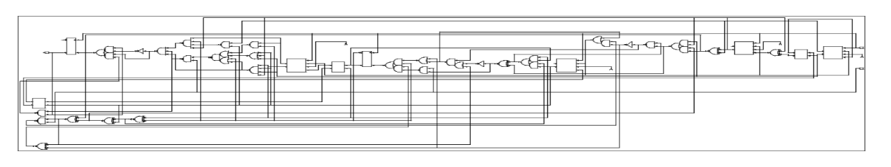

Moreover, properties of single cells can be viewed in the properties. These are pretty the same properties seen in the documentation. 

Here are 2 examples, one is a combinational cell (a XOR cell) and the other is a sequential (a Flip Flop)

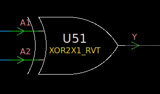

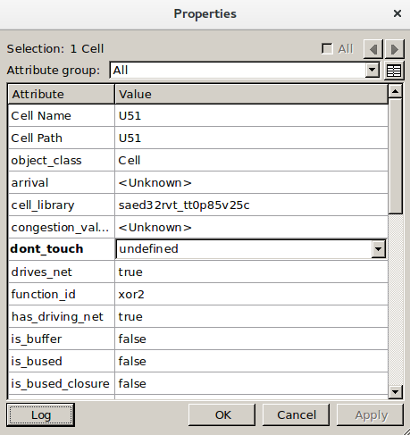

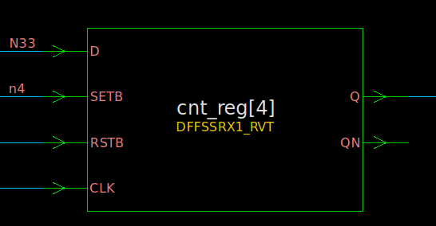

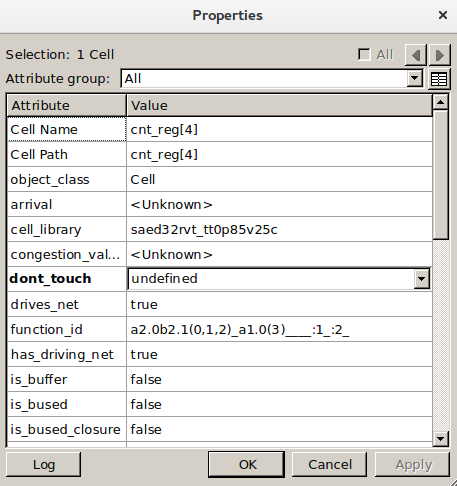

### Locate endpoints of critical Path

It is also possible to highlight the Critical Path. Here is an extract

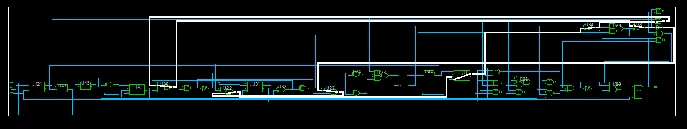

### Synchronous reset

The implementation of the synchronous reset is pretty straightforware and the code can be checked here [g1_res.vhd](g1_res.vhd).
Briefly, it is just necessary to include an `if ...else` condition as first command after having checked the rising edge of the clock.

Here below, the results of the simulation:

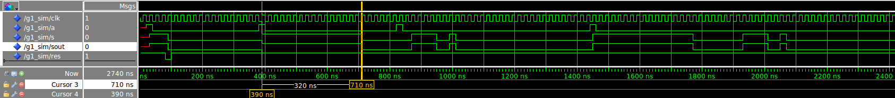

The synthesis also proceeded smoothly. 
The results obtained with this clock target will be considered as a reference.

Here are the two reports: [g1.area](reports_syn/g1.area)[g1.timing](reports_syn/g1.timing)


```
    
    ****************************************
    Report : area
    Design : g1
    Version: N-2017.09-SP4
    Date   : Thu Mar 22 18:30:32 2018
    ****************************************
    
    Library(s) Used:
    
        saed32rvt_tt0p85v25c (File: /packages/LabSoC/Synopsys/EDK/SAED32_EDK/lib/stdcell_rvt/db_ccs/saed32rvt_tt0p85v25c.db)
    
    Number of ports:                            4
    Number of nets:                            52
    Number of cells:                           43
    Number of combinational cells:             32
    Number of sequential cells:                11
    Number of macros/black boxes:               0
    Number of buf/inv:                          2
    Number of references:                      17
    
    Combinational area:                 84.884096
    Buf/Inv area:                        2.541440
    Noncombinational area:              42.187905
    Macro/Black Box area:                0.000000
    Net Interconnect area:               9.884719
    
    Total cell area:                   127.072001
    Total area:                        136.956720
    1


     
    ****************************************
    Report : timing
            -path full
            -delay max
            -max_paths 1
    Design : g1
    Version: N-2017.09-SP4
    Date   : Thu Mar 22 18:30:32 2018
    ****************************************
    
    Operating Conditions: tt0p85v25c   Library: saed32rvt_tt0p85v25c
    Wire Load Model Mode: enclosed
    
      Startpoint: cnt_reg[1] (rising edge-triggered flip-flop clocked by clk)
      Endpoint: cnt_reg[0] (rising edge-triggered flip-flop clocked by clk)
      Path Group: clk
      Path Type: max
    
      Des/Clust/Port     Wire Load Model       Library
      ------------------------------------------------
      g1                 ForQA                 saed32rvt_tt0p85v25c
    
      Point                                    Incr       Path
      -----------------------------------------------------------
      clock clk (rise edge)                    0.00       0.00
      clock network delay (ideal)              0.00       0.00
      cnt_reg[1]/CLK (DFFSSRX1_RVT)            0.00       0.00 r
      cnt_reg[1]/Q (DFFSSRX1_RVT)              0.16       0.16 f
      U36/Y (XOR2X1_RVT)                       0.15       0.32 r
      U35/Y (XOR2X1_RVT)                       0.15       0.47 f
      U33/Y (XNOR2X1_RVT)                      0.13       0.60 f
      U42/Y (INVX1_RVT)                        0.05       0.65 r
      U41/Y (NAND2X0_RVT)                      0.05       0.70 f
      U28/Y (AO21X1_RVT)                       0.09       0.79 f
      U39/Y (NAND2X0_RVT)                      0.05       0.84 r
      U27/Y (AO22X1_RVT)                       0.08       0.92 r
      cnt_reg[0]/RSTB (DFFSSRX1_RVT)           0.02       0.94 r
      data arrival time                                   0.94
    
      clock clk (rise edge)                    2.00       2.00
      clock network delay (ideal)              0.00       2.00
      cnt_reg[0]/CLK (DFFSSRX1_RVT)            0.00       2.00 r
      library setup time                      -0.11       1.89
      data required time                                  1.89
      -----------------------------------------------------------
      data required time                                  1.89
      data arrival time                                  -0.94
      -----------------------------------------------------------
      slack (MET)                                         0.95
    
    
    1

```

In brief: we obtained

* Maximum delay time :   0.94 ns
* Area               :   136.95 square micron

### Synthesis for max clock frequency and minimum area

Here we want to see any difference in synthesizing with different clock constraints than 2.0 ns and try this way to look for minimum Area or Time delay.
Giving a more stricted clock period, the synthesizer will put efforts into having a better timing, increasing so the circuit area.

The [syn.tcl](scripts/syn.tcl) has been modified in order to loop over different clock frequencies from 0.5 to 4.5 in steps of 0.5 ns. Here is a table that reports the results:

| Clock        | Area  (square micron) | Max Delay (ns) |
| ------------- |:-------------:| -----:|
| 0.5      | 190.938279 | 0.79 |
| 1.0      | 148.002577 | 0.87 |
| 1.5      | 136.956720 | 0.94 |
| 2.0      | 136.956720 | 0.94 |
| 2.5      | 136.956720 | 0.94 |
| 3.0      | 136.956720 | 0.94 |
| 3.5      | 136.956720 | 0.94 |
| 4.0      | 136.956720 | 0.94 |
| 4.5      | 136.956720 | 0.94 |

Here we can see that there is a tradeoff between area optimization and time optimization. The more the timing constraint is relaxed, the less area is used. However,, the area improvement saturates only after about 1.5 ns. 
It must be noticed that the configuration with 0.5 ns of clock period, however does not obtain a positive slack. So the circuit is not feasible for that case.
So in this case the minimum area reached is of about 136.956720 square micron. However if we try to run the *compile ultra* with a very relaxed clock (e.g. 3.0 ns) we can reach:


| Clock        | Area (square micron)           | Max Delay (ns) |
| ------------- |:-------------:| -----:|
| 0.5      | 97.180498 | 0.61 |


Instead if we want to target the minimum timing we can stress the synthesys tool to meet more constrained clock. Sweeping clock values between 0.8 to 1.6 ns with step of 0.1 ns we will obtain:

| Clock        | Area  (square micron) | Max Delay (ns) | Slack |
| ------------- |:-------------:| :-----:|-----:|
| 0.8      | 183.708836 | 0.76 |Violated |
| 0.9      | 177.138660 | 0.84 |Met |
| 1.0      | 148.002577 | 0.87 |Met |
| 1.1      | 136.956720 | 0.94 |Met |
| 1.2      | 136.956720 | 0.94 |Met |
| 1.3      | 136.956720 | 0.94 |Met |
| 1.4      | 136.956720 | 0.94 |Met |
| 1.5      | 136.956720 | 0.94 |Met |
| 1.6      | 136.956720 | 0.94 |Met |

Obtaining as maximum frequency 0.9 ns with an area of 183.70 square microns.

### Implementing an asynchronous reset

For the implementation of the asynchronous reset, we need to check the reset before checking the clock rising edge. Moreover, the reset must be included in the sensitivity list. The code is available here:  [g1_ares.vhd](g1_ares.vhd).

Here the waveform that shows the correctness of the reset:

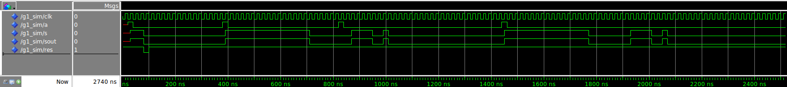


### Flip flop comparisons between asynchronous and synchronous implementations

The two different configurations are synthesized with clock equal to 2.0 ns:

| Configuration | Area  (square micron) | Max Delay (ns) | Flip Flop Type |
| ------------- |:-------------:| :-----:|-----:|
|Synchronous    | 136.956720 | 0.94 | DFFSSRX1_RVT |
|ASynchronous     | 144.942270 | 0.98 | DFFARX1_RVT |

As stated from the table, the synchronous configuration performs slightly better. 
Moreover, two different types of flip-flops are used to implement the asynchronous and synchronous reset. However it is always preferable to use a synchronous reset configuration unless it is strictly specified by the specifications.

### Improve maximum clock frequency with shift register

We can see from the critical path inspection in previous configuration that the bottleneck comes from the adder logic for implementing the counter, together with the logic for checking the counter status.
A good idea, from the timing point of view would be to eliminate the counter and replace it with a shift register. Then we will not have only 5 register bits, but 31. However, for checking the status, we only need to check the bit that corresponds to state to achieve.

So, it is expected, when synthesizing it, to reach a much bigger area but a lower Max delay.

The shift register is implemented with a simple process that assigns at each clock cycle, to each bit the value of the previous bit at exception of the first bit whose value is assigned whether the starting condition is asserted high. (`a`)

Here is the result of the simulation:

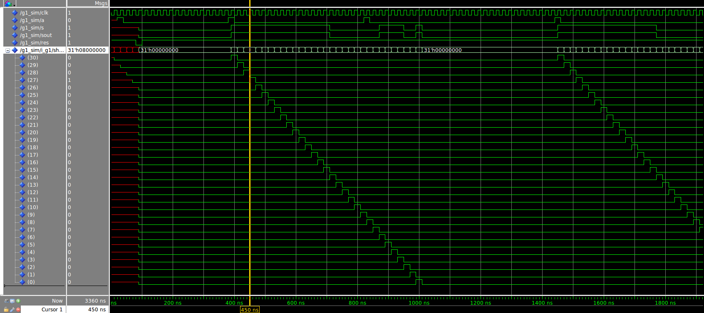


Now, the circuit can be synthesized. Here are the results of the timing and area reports (the complete reports can be found at [reports_syn/g1_min_tim](reports_syn/g1_min_tim).

| Clock  | Area (square micron)  | Max Delay (ns) |
| ------------- |:-------------:| -----:|
| 2.0      | 308.107056 | 0.70 |

As expected, the area is more than the double of the original configuration. However the timing is much less than in previous configurations.
Stressing a little bit the clock, we could reach even lower timing.


### Smallest circuit obtained

To have the smallest circuit possible, I thought to implement the circuit with 5 flip flops instead of 6 since they are the biggest cells. (Look at section * [Block Diagram Drawing](###Block Diagram Drawing) ),  However, the results obtained with the synthesis are not better than the configuration with 6 flip flops (the one used till now). This could be dued by the domination of the combinational area with respect to the sequential area, since the configuration with 5 FF uses two combinational logics.
The code with 5 FFs is available here: [vhdl/g1_doublecom.vhd](vhdl/g1_doublecom.vhd ). For completeness here are the results from this configuration (Clock = 2.0)

| Clock  | Area (square micron)  | Max Delay (ns) |
| ------------- |:-------------:| -----:|
| 2.0      | 147.141418 | 1.32 |

## Implementing G1 in Zybo board

Now, it is time to implement the circuit in the Zybo board. If we implement the circuit as designed, we would not see anything. In fact the clock frequency of the board is too high to notice switches on the leds. Moreover, the leds max switch frequency could be even less, so maybe it could ignore the input value.

So, a way to overcome this problem is to implement a chip enable input. If this is active, then the clock is checked. This way, it is easy to scale the clock, using the "wrapping entity" which assets the `ce` at a scaled frequency. As it says on the [README.md](READMY.md), to have a 10 Hz frequency from 125MHz, we should scale of 12.500.000 . Instead on the [g1_top.vhd](vhdl/g1_top.vhd) the scale is of only 100 000. Probably the clock frequency is lower than stated, because the result of 100000 scaling is still correct.

Then, the synthesis is pretty strightforward (the pins are already mapped thanks to the rename of the component ports).
Without touching the [g1_top.vhd](vhdl/g1_top.vhd), we encounter a bug during the test of the reset. This is due to the fact, that the reset, that is also an input of the wrapping entity, resets it's counter value (used for the scaling). This is not correct as it would reset the counter, then, as the reset in the g1 is synchronous, the `ce` will be asserted only when the reset is released. So the component during the reset will keep its state freezed. Once the reset is released, it can't be caught by the component anymore and so will continue from where it was stopped.

These two gifs will show the correct behaviour of the implementation on Zybo board. The first shows the normal behaviour, the second shows the reset behaviour.


