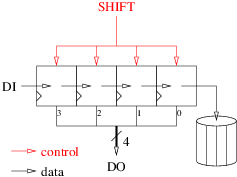

<!-- MASTER-ONLY: DO NOT MODIFY THIS FILE-->
# Shift register (30 minutes)

Shift registers are a very common hardware element that can be found in many designs. This coding challenge consists in designing a 4-bits long shift register.

## Interface

Edit the file named `sr.vhd` in the `20180326` directory. An entity named `sr` (for Shift Register) is already coded with the following input-output ports:

| Name      | Type                            | Direction | Description                                                                 | 
| :----     | :----                           | :----     | :----                                                                       | 
| `clk`     | `std_ulogic`                    | in        | Master clock. The design is synchronized on the **rising** edge of `clk`.   | 
| `sresetn` | `std_ulogic`                    | in        | **Synchronous**, active **low** reset.                                      | 
| `shift`   | `std_ulogic`                    | in        | Shift command input. The register shifts when `shift` is asserted **high**. | 
| `di`      | `std_ulogic`                    | in        | Serial input of the shift register.                                         | 
| `do`      | `std_ulogic_vector(3 downto 0)` | out       | Current value of the shift register.                                        | 

## Architecture

In the same VHDL source file add an architecture named `arc` that:

* Uses `clk` as its master clock. The design is synchronized on the rising edge of `clk`.
* Contains a 4-bits internal register named `reg`.
* Uses `sresetn` as its **synchronous**, active **low** reset to force `reg` to all-zeroes.
* Sends `reg` to `do`.
* Shifts `reg` by one position to the right on each rising edge of `clk` where `sresetn` is not active and the `shift` input is asserted **high**. The leftmost entering bit is `di`. The rightmost leaving bit is lost.



## Validation

````bash
$ cd $tmp
$ vcom $vhdl/sr.vhd
$ vcom $vhdl/sr_sim.vhd
$ vsim sr_sim
```

## Peer review

After the end of the challenge, compare your solution with your neighbours'.

<!-- vim: set tabstop=4 softtabstop=4 shiftwidth=4 noexpandtab textwidth=0: -->
