# Digital Systems 04/04/2017 - Report Lab 5

1. [Challenges](## Challenges)
    * [Shift Register](### Shift Register)
    * [Three Stages Edge detector](### Three Stages Edge detector)
    * [Timer](###Timer)
    * [Counter](### Edge detector)
    * [Game Moore Finite State Machine](### Game Finite State Machine)
    * [DHT11 Mealy Finite State Machine](### DHT11 Finite State Machine)
    * [DHT11 Controller](### DHT11 Controller)
    * [Standalone DHT11](### Standalone DHT11)
2. [Synthesis and implementation](## Synthesis and implementation)
    * [Synthesis of the DHT11 controller](### Synthesis of the DHT11 controller)
    * [Testing the DHT11 controller](### Testing the DHT11 controller)
3. [Moore and Mealy state machines](## Moore and Mealy state machines)
    * [Answer to questions](### Answer to questions)

## Challenges

### Shift register

The challenge was about to design a shift register. In this case, with respect to last implementation, the shift goes from right to left. So the data in is connected to the least significant bit of the register. This is because we will use this component to store the data received from the DHT11 controller and this way first bit will be the most significant bit in the data word.

Here are the results from the simulation while the source file can be found at [vhdl/sr2.vhd](vhdl/sr2.vhd)

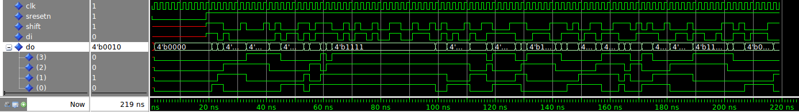

### Three Stages Edge detector

As the communication protocol of the DHT11 works with the rising edges and duration of signals, an edge detector is useful both for detecting the start of the transmission and for computing duration of the high voltage signal which determines whether a sent bit is 0 or 1.

Here is the scheme of such a component:

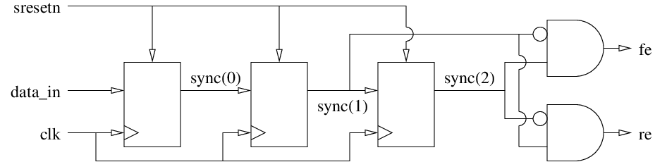

The component takes as input a data, and returns as output two signals : `fe` (falling edge) and `re` (rising edge)
This happens with three stages of flip flops. The last two stages return information about the change of the signal level between two clock cycles: if it was low and then high, then we have a rising edge (a falling edge in the opposite case). If the signal does not change its state, then both the falling edge and rising edge signals will be set to 0.
One could argue that for this purpose only two stages are necessary to do the job. However it is always better to have an additional flip flop as first stage for synchronizing the signal as it comes from outside. This avoids eventual metastability if the input signal changes on the clock rising edge.

Here are the results from the simulation while the source file can be found at [vhdl/edge.vhd](vhdl/edge.vhd)

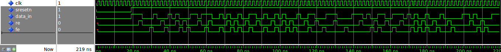

### Counter

The counter is a component that counts every time the `inc` input is asserted high for a clock cycle. In the final design of the `DHT11 controller`, the counter will keep track of the number of bits that have been read. It is provided with a maximum count value as a parameter and the counter is supposed to saturate when this value is reached. Another input, `cz` is needed to reset the counter.

Here are the results from the simulation while the source file can be found at [vhdl/counter.vhd](vhdl/counter.vhd)

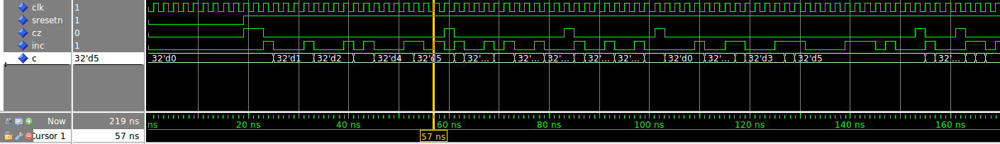

### Timer

With respect to last implementation, the timer does not have major modifications.

The timer takes as input a prescaler of the frequency so that it counts every microseconds in our final target implementation.
However, with respect to last implementation, it does not wrap when it reaches the maximum value but it saturates. Then the high value of the `tz` input bit will make the timer reset. 

The timer is needed for detecting whether a bit is 0 or 1, for waiting for set up times or for detecting error conditions.

Here are the simulation results:

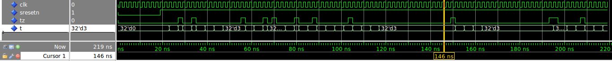

### Game Moore Finite State Machine

In this challenge, a Moore FSM has been implemented. However, the design of this component  has only didactical purpose and is not needed for the implementation of the DHT11 controller.

Following the specification found in the [README.md](README.md) file. The state diagram is provided below:

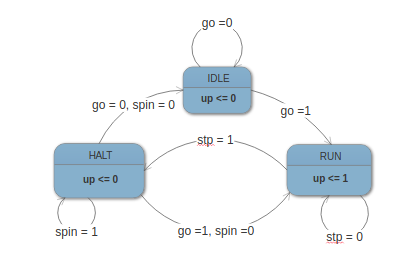

The FSM has been implemented with `3` processes:

- One process implementing the states register.
- One combinatorial process implementing the logic for choosing the `Next State` from the `inputs` and the `Current State`
- One combinatorial process implementing the logic for the outputs from the `Current State`

As it will be discussed later, only 2 processes would be enough for implementing such a system.

Here are the results from the simulation while the source file can be found at [vhdl/sm.vhd](vhdl/sm.vhd)

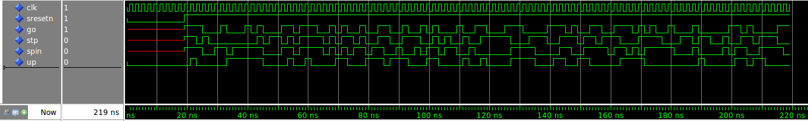

### DHT11 Mealy Finite State Machine

Now, it is time to implement the FSM that regulates the transmission with the DHT11 device.
The specifications are provided in the [README.md](README.md). To better visualize what is going to be implemented, it is good practice to draw the state diagram:

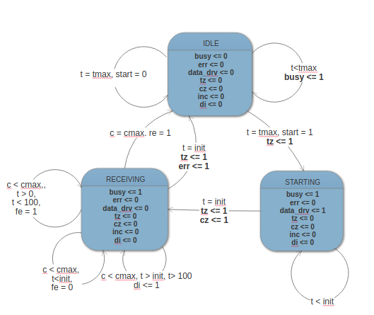

In this case, a Moore state machine cannot describe our specification. Or better, it could, but the design would be much more complex as it would require every timer value to be coded in a state. So it is better to use a Mealy state machine.
However, some glitching problems have been detected during the simulation of the final `DHT11 controller`.

This design was not tested until the next step, due to the fact that a testbench is not provided. The source file can be found at [vhdl/sm2.vhd](vhd/sm2.vhd)

### DHT11 Controller

Finally, it is possible to instantiate the DHT11 controller entity connecting all the components designed till now. The scheme provided in the [dht_ctrl.md](dht_ctrl.md) has been followed.

Beside connecting the components in the right way, no particular attention had to be paid. Some signals had to be declared to connect internally the components.

Here are the results from the simulation while the source file can be found at [vhdl/dht11_ctrl.vhd](vhdl/dht11_ctrl.vhd)

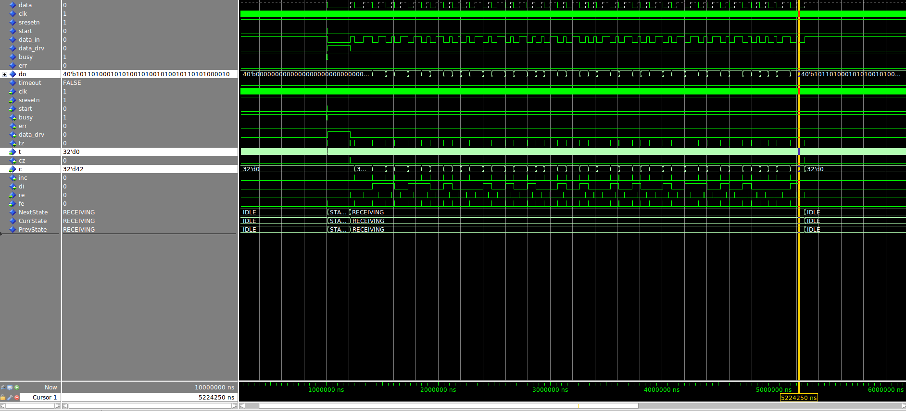

### Standalone DHT11

Now it is time to implement the design on the Zybo board. However, a wrapper entity is needed before doing that. In fact the `dht11_ctrl` is still missing some components:

-  A tristate buffer is needed to interface with the `DHT11 sensor`. This is because the `data_in` must be pulled up either from the `dht11_ctrl` (when starting the transmission) or from the `dht11 sensor` (when sending the measurement).
- A process for synchronizing and inverting the reset which, being triggered by a button, is asynchronous. 
- An edge detector for retrieving the `start` signal from the push of the button. 
- A process for driving the `received data`, `err` and `busy` signals to the `leds` depending on the configuration of the switches. 

## Synthesis and implementation

### Synthesis of the DHT11 controller

In order to proceed with the synthesis, the [scripts/dht11_ctrl_sa.syn.tcl](scripts/dht11_ctrl_sa.syn.tcl) must be completed with the pins names of the peripheral used. Here is a table that resumes the mapping:

| PORT | PIN | VOLTAGE |
| -- |:---:| --:|
| clk           | L16 | LVCMOS33 |
| sw[0]         | M14 | LVCMOS33 |
| sw[1]         | G15 | LVCMOS33 |
| sw[2]         | P15 | LVCMOS33 |
| sw[3]         | W13 | LVCMOS33 |
| led[0]        | M14 | LVCMOS33 |
| led[1]        | M15 | LVCMOS33 |
| led[2]        | G14 | LVCMOS33 |
| led[3]        | D18 | LVCMOS33 |
| btn0          | R18 | LVCMOS33 |
| btn1          | P16 | LVCMOS33 |
| data          | V12 | LVCMOS33 |

Then, when launching the script with `vivado`,  the `init`, `tmax` and `cmax` must be passed as parameters. Here is the choice used for the implmentation according to the specification of the `DHT11 sensor`:

| init | tmax | cmax |
| -- |:---:| --:|
| 20000 | 1000000 | 42 |

### Testing the DHT11 controller

Finally the controller can be tested on the board, but first the `DHT11 sensor` must be connected properly to the board.

From the specification we need to connect three pins: 

- The power supply
- The ground
- The signal

The sensor comes with a support that facilitates the connection of the pins. Here is a photo:

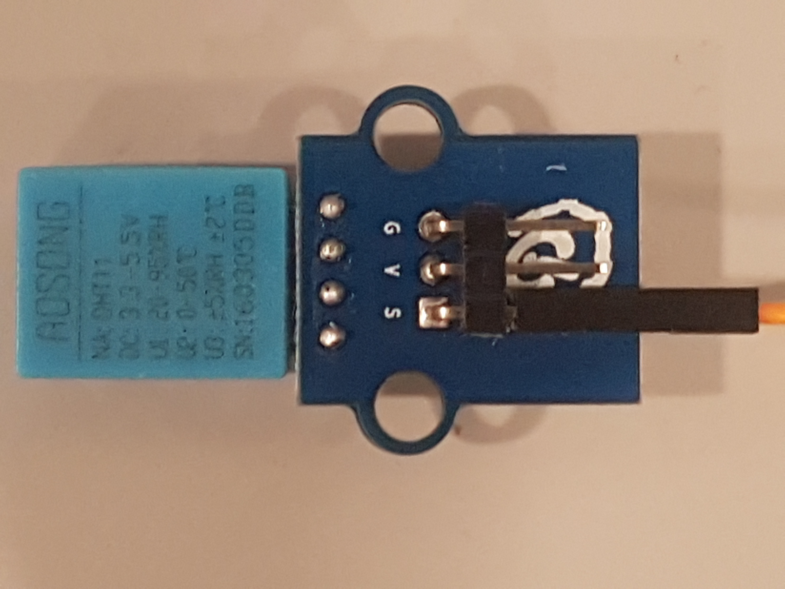

The `G` stands for the ground, the `V` the voltage and the `S` for the signal. In order to provide the ground and voltage level, we can use the respective ports provided by the `JE` port. Now, the connection can be done directly for the `supply` and the `ground` while the `signal` can be connected to the `pin1` with the male female jumper.

Here is a photo that shows the connection:

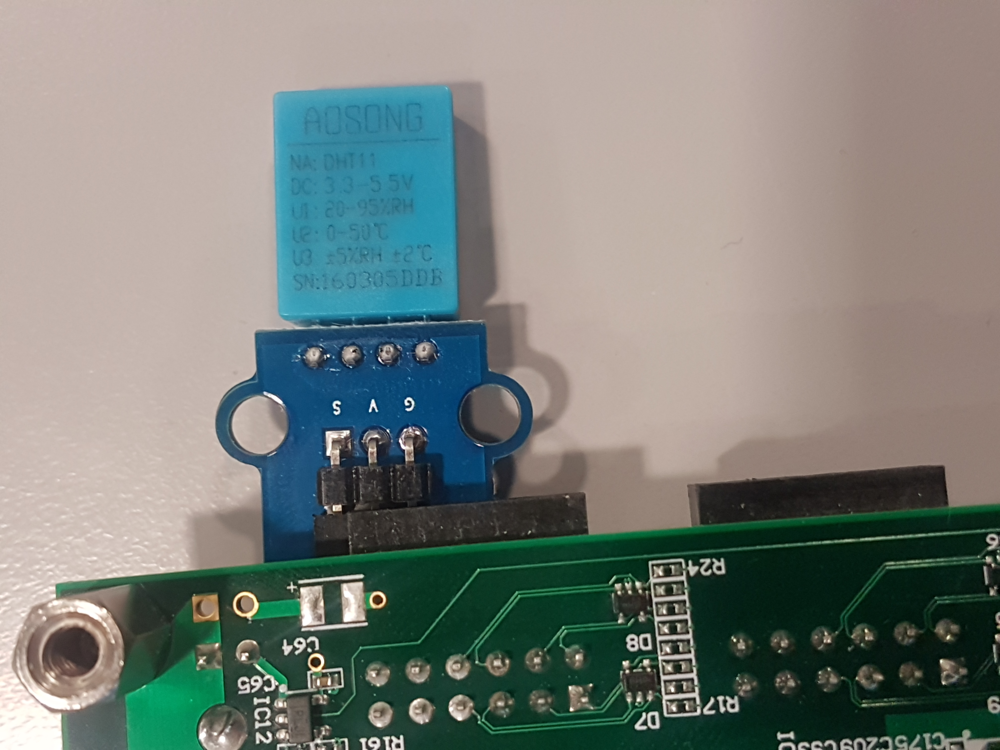

Here are other photos showing the correct behaviour of the device. The switches are set so that the 3rd byte of the data word drives the leds (4 bits at a time). The temperature measured in the laboratory is 27 Celsius degrees.

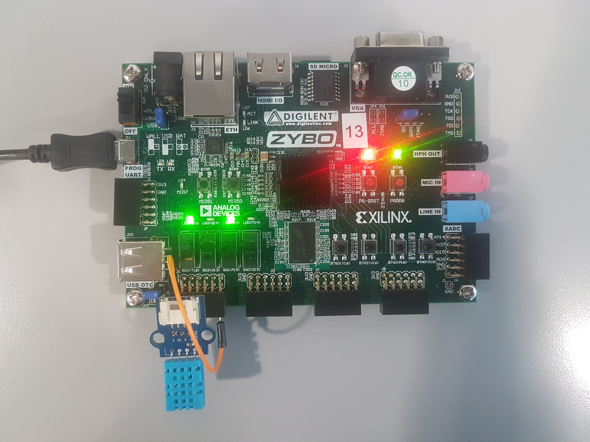

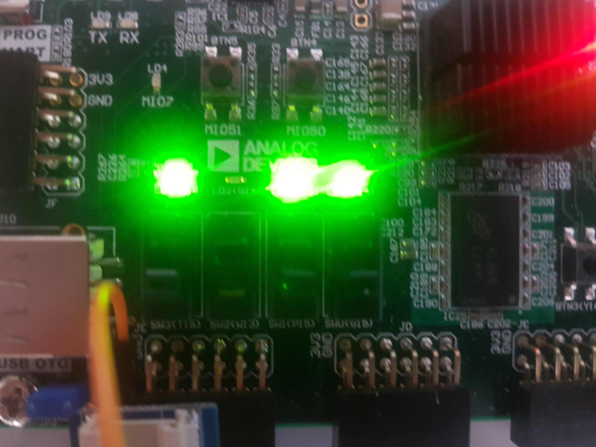

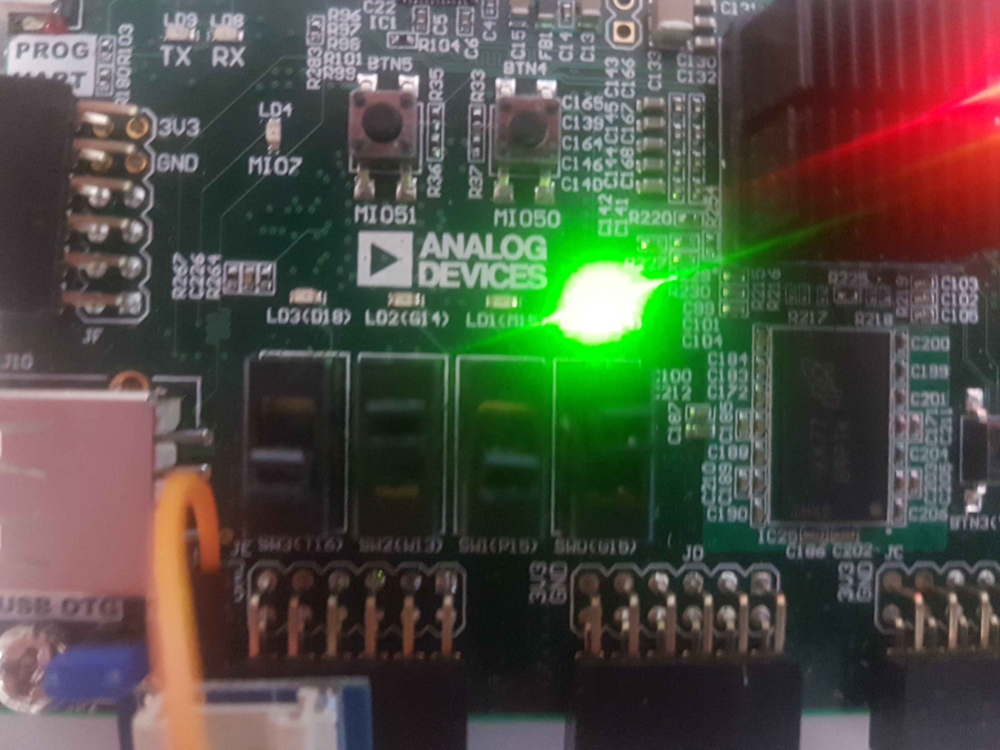

## Moore and Mealy state machines

### Answers to questions

* **What is a finite state machine?**

A finite state machine is a model used generally to express a sequential behaviour of a machine. Any digital systems can be considered as a finite state machine. The output of the FSM is driven depending on the states or the states and the inputs depending on the implementation (see later Mealy vs Moore).
It is composed at least combinational logics (generally two) and a memory to keep track of the state:

- A first logic is used to compute the next state from the current state and the inputs.
- A second logic is used to compute the outputs.
- A memory is just a register with a length of at least log(N) where N is the number of the states. The states are so coded in binary.

The codification of the states is not trivial. In fact, a good codification can result in a faster design, or less power consuming or even smaller.
In VHDL you can use either a enumerate data type or an integer type. In the first case we let the synthesizer look for the best solution given the constraints. In the latter case we have more control on the states as the sysnthesizer will synthesize the states as you designed them.
    

* **What are the differences between Moore and Mealy state machines?**

The two can both implement a finite state machine. However theyjpg present some differences:
In the Mealy state machine, the outputs are computed from the current state and the inputs.
The Moore state machine, the outputs are computed only from the current state.
The mealy machines can be connected one after the other without particular problems as the there is no path that goes directly from input to output,  without passing from a register. So the overall critical path does not risk to be the sum of consecutive critical paths of the FSMs.
In the Mealy case, as the output is computed both from the input and the states, there exists a path from input to output without passing from registers. However, a Mealy machine usually result in less area when it comes to synthesis. In fact, many times it is possible to avoid some "intermediate" state. By the way, the fact of having input connected to the output can result in glitches that are unconvenient to have in a digital systems.

* **What are the advantages and drawbacks of Moore and Mealy state machines?**

The Moore implementation is synchronized as the outputs comes from a Combinational logic driven by registers, so as there is no path between inputs and outputs, there is always a register in between. This benefits when multiple FSMs stages are put one after the others because it avoids to increase the critical paths stage after stage.
The Mealy implentatin is not synchronized. It results in a smaller circuit than in the Moore case. However the presence of glitches and the facto of possibly having a critical path between inputs and outputs could make this design inconvenient.

* **Can we say that a Moore state machine is a special case of a Mealy state machine?**

Theoretically yes, in the case that the Mealy machines output does not depend on inputs. By the way, in this case you would not call it a Mealy Machine but a Moore Machine.

* **Can we say that a Mealy state machine is a special case of a Moore state machine?**

No, this is not possible as because in the Moore case the outputs cannot depend on the inputs.

* **What does the states diagram of a Moore state machine look like? Where do we indicate the value of the ouptuts? The conditions of the transitions?**

The states diagram corresponds to bubbles connected through edges. The bubbles represent the state and inside each bubble there are the outputs in that state. The edges represent the transitions between two states. As this depend only on the inputs, we can find the inputs that trigger such transitions. Here is an example of it:

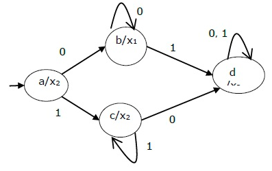

* **Draw the block diagram of a Moore state machine.**

The block diagram of a Moore state machine is the following:

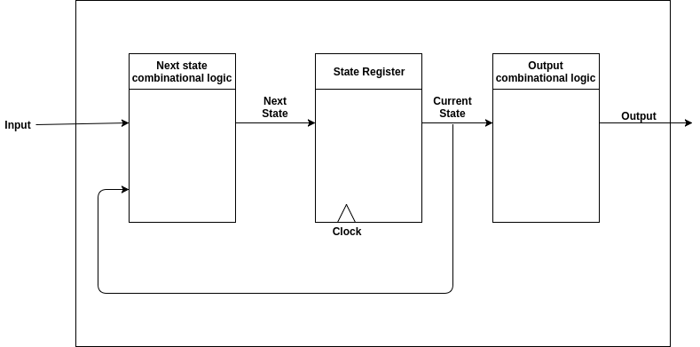

As we can see, the diagram contains the state register and the two combinational logic. One of them computes the next transition from the inputs while the second one computes the outputs from the states.

* **What is the minimum number of processes needed to model a Moore state machine? Why?**

2 at least. One is used to express the first combinational logic and the state registers. (This process should have the clock in sensitivity list and operate and the rising edge). The other process simply express the second combinational logic.    

* **Are there specific Moore state machines that can be modelled with less processes?**

Yes. If the outputs correspond to the coded state, then the second combinational logic is simply a wire. So no need for the second process. an example of such a case can be a timer.

* **What does the states diagram of a Mealy state machine look like? Where do we indicate the value of the ouptuts? The conditions of the transitions?**

The state diagram of a Mealy machine is similar to the Moore one, except that, as the output is also dependent on the inputs, on the edge of the states it is possible to find also the output. Here is an example of such a diagram:

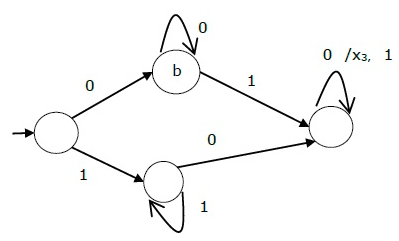

* **Draw the block diagram of a Mealy state machine.**

The block diagram of a Moore state machine can be the following:

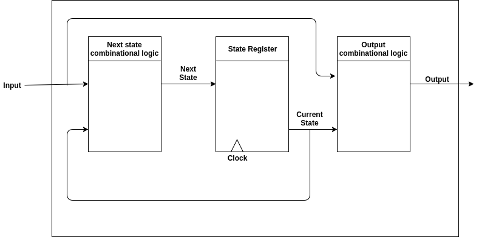

The diagram is the same as the Moore case, except that the inputs are connected to the Output combinational logic.

* **What is the minimum number of processes needed to model a Mealy state machine? Why?**

2 at least. Same considerations done for the Moore case.

* **Are there specific Mealy state machines that can be modelled with less processes?**

Yes, when we have the particular case where the outputs correspond to the codification of the states or the inputs or a concatenation of the two for example.