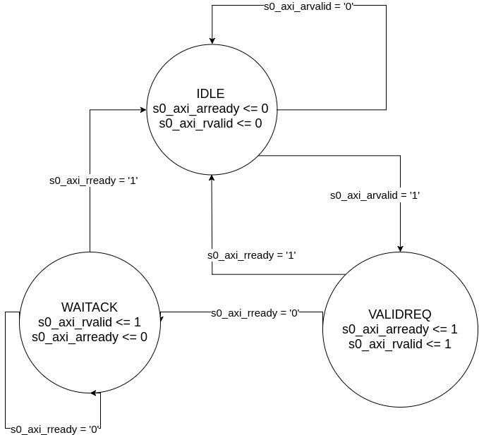
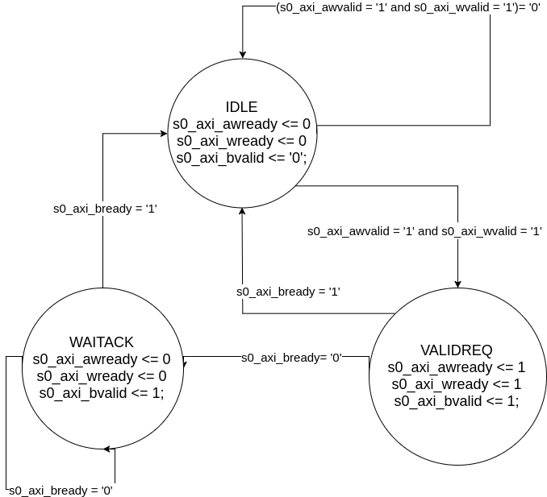
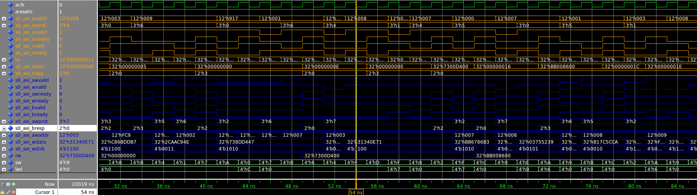
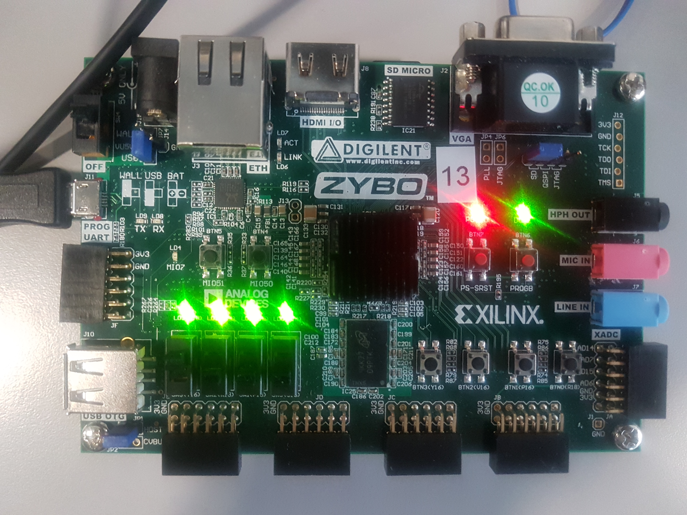
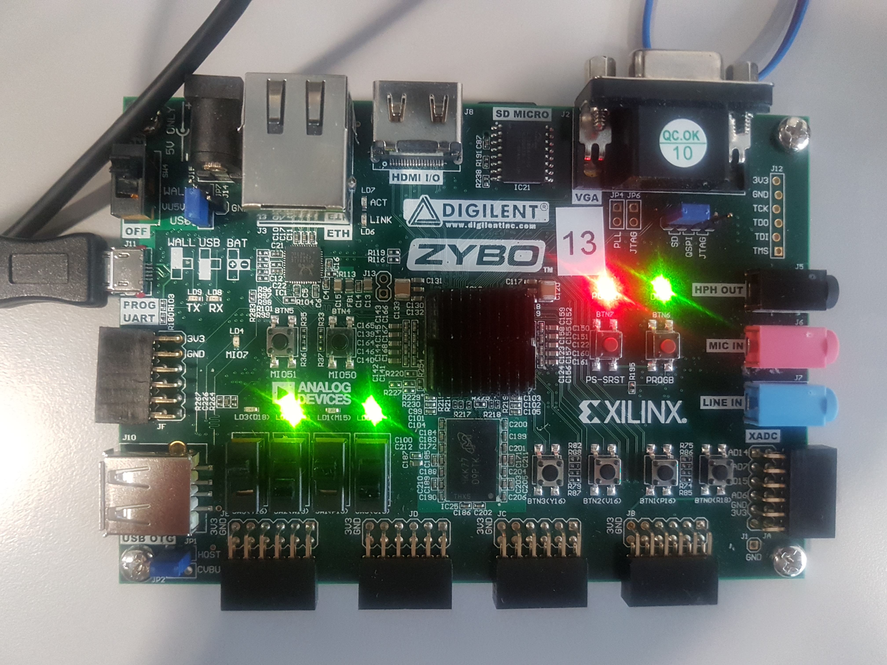

# Digital Systems 16/04/2018 - Report Lab 6

1. [AXIL4 Register](## AXIL4 Register)
    * [State diagrams](### State diagrams)
    * [VHDL implementation](### VHDL implementation)
    * [Simulation](### simulation)
2. [Testing on board](## Synthesis and implementation)
    * [Synthesis of the DHT11 controller](### Synthesis of the DHT11 controller)
    * [Testing the DHT11 controller](### Testing the DHT11 controller)
3. [Moore and Mealy state machines](## Moore and Mealy state machines)
    * [Answer to questions](### Answer to questions)
    
    
## AXIL4 Register

### Description

The AXI Lite 4 protocol allows the communication between two devices, a Master and a Slave. In this laboratory, the slave entity is considered.
In the case considered, the device manages two operations: `write` and `read`to two registers, one which is only readable, and the second which can be read and written. 
The read only register (`ro`) can only be accessed with the `read` operation. The register value increments by one at each clock cycle or `0` when the `reset` is active.
The read write register (`rw`) can be accessed with both the `read` and `write` operations. This means that its value is written by the Master entity or when `reset` is active.
The AXI Lite4 is a handshake based protocol. Its behavior can be described through a Finite State Machine. However, as the read and write operations work independently, two FSMs have to be designed.

### State diagrams

As a first step, it is convenient to express the two operations with State Diagrams so that their implementations will be more straightforward.

As said before, the FSMs are in charge to manage the handshake protocol. Being a Master-Slave architecture, in both the cases the Master initializes the operation.
In the case of `read` operation, the starting condition is expressed by the `arvalid` which says that the address for the read is ready. Then the Slave will respond with the acknowledge of the address (`arready`) and loading the data (`rvalid`). The communication will end as soon the Master repsonds with the acknowledge of the data received (`rready`).



In the case of a `write` operation, the Master will start the transmission when both the address and the data are ready (asserting both the `awvalid` and the `wvalid` signals). The slave will respond with the aknowledges (`awready`, `wready`). Then it will raises a `bvalid` signal to be "handshaken" from the Master for ending the operations.



In both the cases, the transmission can terminate in two or more clock cycle.


### VHDL Implementation

The component can be entirely expressed in a behavioural way using multiple processes.

In my implementation, here are the processes used 

- 3 processes for each read FSM (could be reduced to 2 processes each)
- 3 processes for each write FSM (could be reduced to 2 processes each)
- 1 process for driving the output to the leds using the switches
- 1 process for driving the `ro` or `rw` registers to `readdata` output and the status
- 1 process for driving the `writedata` input to the `rw` register and for the status
- 1 process for incrementing the `ro` register.
 

#### Implementation of the `ro` behaviour (wrapping timer)


```
-- process for incrementing the read only register by one at each clock cycle and wrapping when reached the maximum value
    process (aclk)
    begin
        if rising_edge(aclk) then
            if aresetn = '0'  then
                ro <=  (others => '0');
            else
                if ro /= "11111111111111111111111111111111" then
                    ro <= std_ulogic_vector(to_unsigned(to_integer(unsigned( ro )) + 1, 32));
                else
                    ro <= (others => '0');
                end if;
            end if;
        end if;
    end process;

```

#### Read from registers and status assert

This synchronous process drive the `rw` or `ro` registers to the `rdata` and `rresp` depending on the `address` or the `reset` value.
Here is an extract. Note that the update of the output is done on the transition between the IDLE state and the following state where the component, just before raising the `rvalid` signal that tells the master that the data is ready to be read.

```
-- Process for driving the ro signal to the output rdata    
    process (aclk)
    begin
        if rising_edge(aclk) then
            if aresetn = '0' then
                s0_axi_rdata <=  (others => '0');
                s0_axi_rresp <= (others => '0');
            else
                if s0_axi_arvalid = '1' and CurrStateR = IDLE then
                    if addr_r_aligned = "0000000000" then
                        s0_axi_rresp <= axi_resp_okay;
                        s0_axi_rdata <= ro;
                    elsif addr_r_aligned = "0000000001" then
                        s0_axi_rdata <= rw;
                        s0_axi_rresp <= axi_resp_okay;
                    else
                        s0_axi_rdata <= (others => '0');
                        s0_axi_rresp <= axi_resp_decerr;
                    end if;
                end if;
            end if;
        end if;
    end process;
```

#### Write `wdata` to `rw` register and status assert
Similarly to the read case, this process update the rw register just after having received the validation from the master.

```
-- writing on the register
process (aclk)
begin
    if rising_edge(aclk) then
        if aresetn = '0' then
            rw <= (others => '0');
            s0_axi_bresp <= (others => '0');
        else
            if s0_axi_awvalid = '1' and s0_axi_wvalid = '1' and CurrStateW = IDLE then
                if addr_w_aligned = "0000000001" then
                    s0_axi_bresp <= axi_resp_okay;
                    if s0_axi_wstrb(0) = '1' then
                        rw(7 downto 0) <= s0_axi_wdata(7 downto 0); 
                    end if;
                    if s0_axi_wstrb(1) = '1' then
                        rw(15 downto 8) <= s0_axi_wdata(15 downto 8); 
                    end if;
                    if s0_axi_wstrb(2) = '1' then
                        rw(23 downto 16) <= s0_axi_wdata(23 downto 16); 
                    end if;
                    if s0_axi_wstrb(3) = '1' then
                        rw(31 downto 24) <= s0_axi_wdata(31 downto 24); 
                    end if;
                elsif  addr_w_aligned = "0000000000"then                        
                    s0_axi_bresp <= axi_resp_slverr;
                    s0_axi_bresp <= axi_resp_slverr;
                else
                    s0_axi_bresp <= axi_resp_decerr;
                end if;
            end if;
        end if;
    end if;
end process;
```


#### Driving the output on the leds.

This operation simply drives the led depending on the configuration of the switches in a combinatorial way. The 3 least signficant switches determine what range of the register to drive, the most significant switch instead decides whether to drive the `ro` or the `rw` register.
A `case` statement can describe this operation:

```
-- Process for driving read byte using the switches
process (sw, ro, rw)
begin
    case sw is
        when "0000" =>
            led <= ro(3 downto 0);
        when "0001" =>
            led <= ro(7 downto 4);
        when "0010" => 
            led <= ro(11 downto 8);
        when "0011" =>
            led <= ro(15 downto 12);
        when "0100" =>
            led <= ro(19 downto 16);
        when "0101" =>
            led <= ro(23 downto 20);
        when "0110" =>
            led <= ro(27 downto 24);
        when "0111" =>
            led <= ro(31 downto 28);
        when "1000" =>
            led <= rw(3 downto 0);
        when "1001" =>
            led <= rw(7 downto 4);
        when "1010" => 
            led <= rw(11 downto 8);
        when "1011" =>
            led <= rw(15 downto 12);
        when "1100" =>
            led <= rw(19 downto 16);
        when "1101" =>
            led <= rw(23 downto 20);
        when "1110" =>
            led <= rw(27 downto 24);
        when "1111" =>
            led <= rw(31 downto 28);
        when others =>
            led <= "1010";
    end case;

end process;
```

### Simulation

Finally the component can be simulated and validated.
Here are the waveforms. The source code is available at [vhdl/reg_axi.vhd](vhdl/reg_axi.vhd).



### Testing on the board

For the synthesis of the component, thanks to the [scripts/reg_axi.syn.tcl](scripts/reg_axi.syn.tcl), nothing much had to be done. The operation proceeded smoothly without errors.

It is possible to check the right working of the device watching the leds. While the 'ro' register working can be checked immediately as it does not depend on the protocol, the write and the read operations must be checked in another way.
In order to do so, we use an operating system running on the ARM processor. Then this can be accessed serially using `picocom` from the host machine connecting through USB.
Once inside the OS, we can use the `devmem` utility to read or write at particular addresses.
From the synthesis script, we notice that the `ro` is mapped at the address `0x40000000` and the `rw` register at `0x40000004`.
For reading we will run:

```
devmem 0x40000000
```

While for writing the value "0x55FF" we can type:

```
devmem 0x40000004 16 0x55FF
```

Everything worked correctly as expected. The write value then has been checked with the leds on the board. We can also check the ARM processor uses a `little endian` byte orderingHere are some pictures that show the correct working:

#### `RO` register incrementing


#### Writing the the `RW` register

First 4 bits of first byte




First 4 bits of second byte




